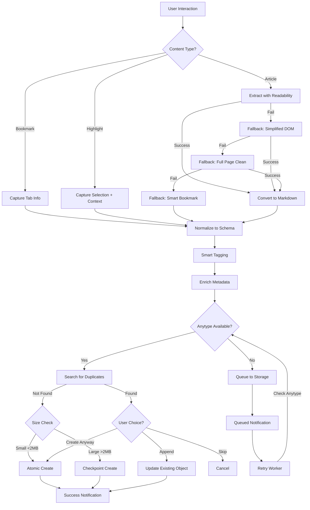
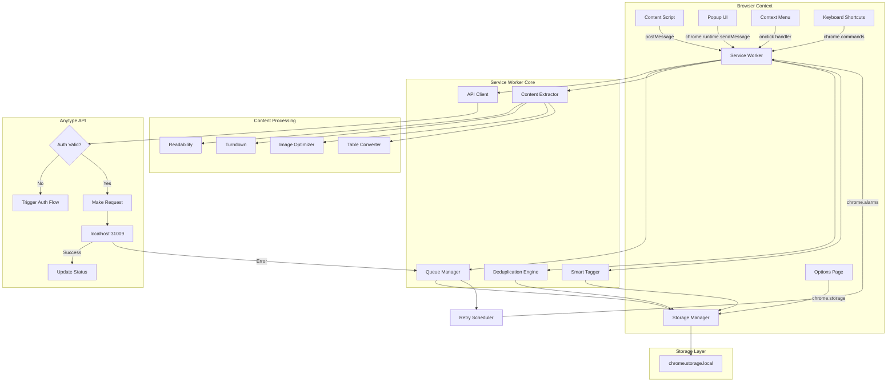
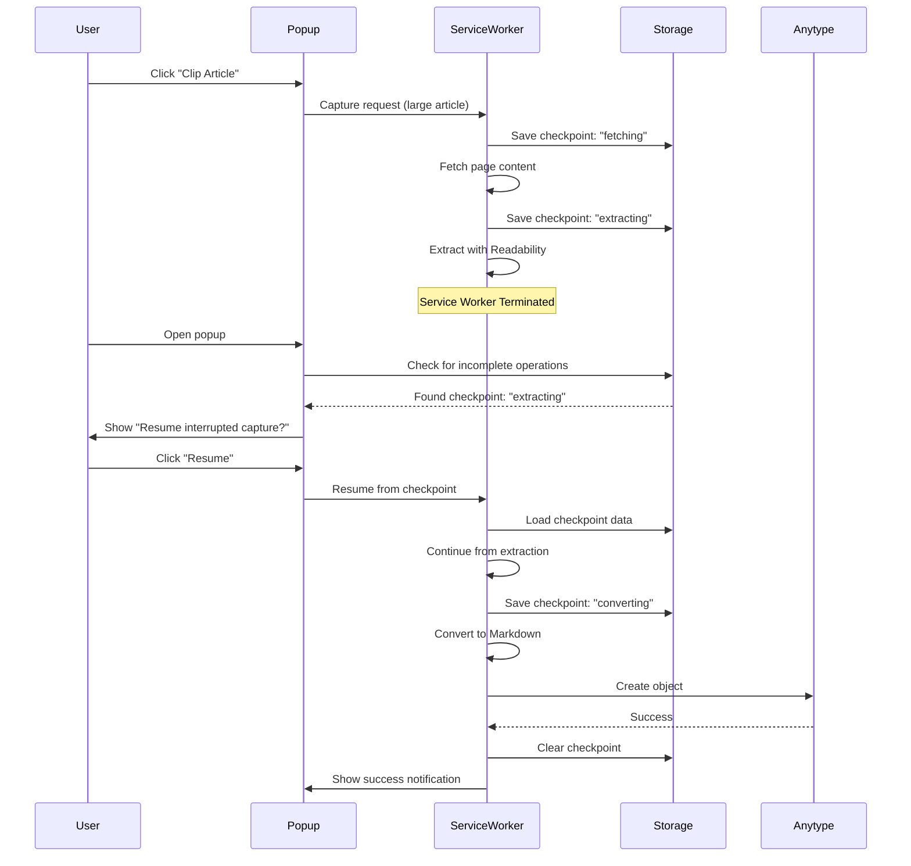

# PRD: Anytype Clipper Extension

### Properties

- **Product:** Anytype Clipper Extension
- **Version:** 1.0
- **Status:** Draft
- **Owner:** [TBD]
- **Stakeholders:** [TBD]
- **Target Release:** [TBD]
- **Tags:** #prd #browser-extension #anytype

---

## Summary

The Anytype Clipper Extension enables users to capture web content (bookmarks, highlights, articles) directly into their local Anytype workspace via a Brave/Chromium browser extension. It provides Space/Type selection, offline queueing, deduplication, reliable content extraction with Markdown formatting, smart tagging, reading list management, and advanced content enrichment features.

---

## Details

### Problem Statement

Users of Anytype Desktop currently lack a seamless way to capture web content into their local workspace. Existing solutions require manual copy-paste, lose formatting, or depend on cloud services. Users need a direct, privacy-respecting browser extension that works with the local Anytype API with intelligent content processing and organization capabilities.

### Goals

- Enable one-click capture of bookmarks, highlights, and articles into Anytype
- Provide Space and Type selection for flexible content organization
- Work reliably when Anytype is offline via persistent queue with intelligent retry
- Preserve content formatting using Markdown conventions with fallback strategies
- Prevent duplicate entries via URL-based deduplication with variation handling
- Maintain user privacy by using only localhost API calls
- Provide smart tagging and auto-categorization for better organization
- Support reading list workflow for "read later" use cases
- Enable content enrichment with metadata extraction
- Offer flexible capture modes (simplified, full page, selection)

### Non-Goals

- Cloud-based sync or remote API endpoints
- Mobile browser support (Chrome Android, Safari iOS)
- Real-time bidirectional sync with Anytype
- Integration with other note-taking apps beyond Anytype
- Advanced NLP or AI-powered content analysis (beyond basic keyword extraction)
- Social sharing features
- Collaborative editing within the extension
- Browser bookmark import/migration tools

### Target Audience

- Anytype Desktop users on Linux (primary), Windows/macOS (secondary)
- Knowledge workers who actively browse and research
- Users who value privacy and local-first workflows
- Power users comfortable with browser extensions
- Students and researchers collecting reference materials
- Content curators building knowledge bases

---

## Functional Requirements

### FR1: Authentication

- **FR1.1:** First-run authentication using Anytype challenge code flow
- **FR1.2:** Display 4-digit code obtained from POST /v1/auth/challenges
- **FR1.3:** Exchange challenge for API key via POST /v1/auth/api_keys
- **FR1.4:** Store API key securely in chrome.storage.local (unencrypted, localhost-only API)
- **FR1.5:** Provide "Disconnect" action to revoke and clear stored credentials
- **FR1.6:** Detect 401 responses and trigger automatic re-authentication
- **FR1.7:** Show non-intrusive notification when re-auth needed (queue captures, don't block)
- **FR1.8:** Implement token refresh flow if Anytype API supports it

### FR2: Space & Type Selection

- **FR2.1:** Fetch available Spaces via GET /v1/spaces on popup open
- **FR2.2:** Display Space selector dropdown in popup UI
- **FR2.3:** Provide Type selector: Bookmark, Highlight, Article, Note, Task
- **FR2.4:** Allow optional "Append to object" mode with object search/picker
- **FR2.5:** Remember last-used Space and Type as defaults
- **FR2.6:** Require user to select default Space on first use (no automatic fallback)
- **FR2.7:** Support hierarchical organization: Space → Collection → Object
- **FR2.8:** Quick-add to predefined collections from popup
- **FR2.9:** Allow users to configure default Object Type for each capture mode (Article, Highlight, Bookmark)
- **FR2.10:** Display Object Type selector dropdown in popup for on-the-fly selection during capture
- **FR2.11:** Remember last-used Object Type per capture mode as default for next capture
- **FR2.12:** Support custom Anytype Object Types beyond built-in types (Bookmark, Highlight, Article, Note, Task)

### FR3: Bookmark Capture

- **FR3.1:** Capture current tab URL, title, favicon, timestamp
- **FR3.2:** Allow user to add tags and notes before sending
- **FR3.3:** Create Anytype object with properties:
  - Title
  - URL (normalized)
  - Site (domain)
  - Tags
  - CreatedAt
  - SourceApp="AnytypeClipper"
  - Author (from meta tags if available)
  - Description (from meta description)
- **FR3.4:** Show success notification with link to view in Anytype
- **FR3.5:** Optional screenshot capture (user-configurable, default: off)
  - Use chrome.tabs.captureVisibleTab
  - Compress to WebP format, limit to 500KB
  - Requires <all_urls> permission
- **FR3.6:** Extract and save PDF links found on page
- **FR3.7:** Add Archive.org Wayback Machine snapshot link for preservation

### FR4: Highlight Capture

- **FR4.1:** Detect text selection on page via content script (injected on activation)
- **FR4.2:** Capture selected text plus 50 chars before/after as context
- **FR4.3:** Include source URL, page title, selection timestamp
- **FR4.4:** Create Anytype object with properties:
  - Quote (selected text)
  - Context (surrounding text)
  - URL (normalized)
  - PageTitle
  - Tags
  - CreatedAt
  - Author (if available)
- **FR4.5:** Provide context menu action "Send selection to Anytype"
- **FR4.6:** Support multiple highlights per page in single capture session
- **FR4.7:** Visual indicator on page showing what's already been captured
- **FR4.8:** Allow users to add personal notes/comments to highlights before saving
- **FR4.9:** Append multiple highlights to same object with timestamps and source links

### FR5: Article Capture

- **FR5.1:** Extract article content using 4-level waterfall approach:
  1. **Primary:** Mozilla Readability algorithm
  2. **Fallback 1:** Simplified DOM extraction (largest article tag, highest text density)
  3. **Fallback 2:** Full page capture with cleaning (strip scripts, styles, nav, footer)
  4. **Final Fallback:** Smart bookmark with enhanced metadata
- **FR5.2:** Convert extracted HTML to Markdown using Turndown
- **FR5.3:** Preserve headings, lists, code blocks, quotes, links
- **FR5.4:** Handle code blocks with language detection for syntax highlighting
- **FR5.5:** Table preservation strategy:
  - Simple tables (≤6 cols, no merges, <20 rows): Markdown table syntax
  - Complex tables: Preserve as HTML blocks within Markdown
  - Data tables: Convert to JSON/CSV + HTML fallback
- **FR5.6:** Image handling (smart embedding strategy):
  - Images <500KB: Convert to base64 data URLs
  - Images >500KB: Keep as external URLs
  - Critical images (hero/featured): Always embed
  - Respect CORS, optimize to WebP 85% quality
  - Limit to 20 embedded images per article
  - User-configurable: Always embed / Smart (default) / Never embed / Upload to Anytype
- **FR5.7:** Capture metadata:
  - URL (normalized)
  - Author (from schema.org, Open Graph, or byline)
  - Published date (from meta tags)
  - Reading time estimate
  - Site name
  - Featured image
- **FR5.8:** Create Anytype object with Markdown body and metadata properties
- **FR5.9:** Provide context menu action "Clip article to Anytype"
- **FR5.10:** Show extraction quality feedback:
  - Success: "Article captured (X words)" (green)
  - Fallback 1/2: "Article captured (simplified)" (yellow)
  - Fallback 3: "Saved as bookmark - extraction failed" (orange)
- **FR5.11:** Offer "Retry extraction" option for failed captures

### FR6: Offline Queue

- **FR6.1:** Persist capture requests to chrome.storage.local when Anytype unreachable
- **FR6.2:** Display queue status in popup with pending count and badge counter
- **FR6.3:** Implement retry logic with exponential backoff (1s, 5s, 30s, 5m intervals)
- **FR6.4:** Mark items as queued/sending/sent/failed with error messages
- **FR6.5:** Allow manual retry or delete for failed items
- **FR6.6:** Limit queue to 1000 items with FIFO eviction
- **FR6.7:** Health check ping to localhost:31009 (or custom port) before requests
- **FR6.8:** Service worker recovery mechanisms:
  - **Atomic operations** for bookmarks, highlights, small articles (<2MB)
  - **Checkpoint-based recovery** for large articles (>2MB or >5000 words)
  - Save checkpoint state after each processing phase
  - Resume from last checkpoint on service worker restart
  - "Resume interrupted captures" button in popup for manual recovery
- **FR6.9:** Queue survives browser restart and service worker termination
- **FR6.10:** Process captures sequentially (not parallel) to respect API limits
- **FR6.11:** Detailed sync status dashboard:
  - Timestamps, retry counts, error logs
  - Export queue as JSON for debugging
  - Statistics: total captures, success rate, most-captured domains
- **FR6.12:** Debug log (max 1000 entries, FIFO):
  - Timestamp, action, status, sanitized error messages
  - Accessible via options page with "Export Log" button
  - Auto-clear logs older than 30 days

### FR7: Deduplication

- **FR7.1:** Search existing objects by URL before creating new bookmark
- **FR7.2:** URL matching handles variations:
  - http vs https
  - Trailing slashes
  - Query parameters (optional matching)
  - URL fragments
  - www vs non-www
- **FR7.3:** Normalize URLs before comparison (lowercase, remove tracking params)
- **FR7.4:** Offer "Append to existing" option if duplicate found
- **FR7.5:** For append mode, add new section with timestamp and source link
- **FR7.6:** Display warning in popup if duplicate detected
- **FR7.7:** User-configurable: Enable/disable deduplication checks
- **FR7.8:** "Similar content" detection using fuzzy matching (future enhancement)

### FR8: Smart Tagging & Auto-categorization

- **FR8.1:** Extract keywords from article content using TF-IDF or frequency analysis
- **FR8.2:** Suggest tags based on domain patterns:
  - github.com → #development, #opensource
  - arxiv.org → #research, #academic
  - medium.com → #article, #blog
- **FR8.3:** Learn from user's past tagging patterns (privacy-preserving, local only)
- **FR8.4:** Display suggested tags in popup with one-click add
- **FR8.5:** Allow users to customize domain → tag mappings in settings
- **FR8.6:** Extract and suggest tags from article meta keywords
- **FR8.7:** Limit auto-suggested tags to 5 per capture

### FR9: Reading List / "Read Later" Mode

- **FR9.1:** Quick capture to designated "Reading List" object without opening popup
- **FR9.2:** Keyboard shortcut for instant save (user-configurable, default: Ctrl+Shift+S)
- **FR9.3:** Badge counter showing unread items in reading list
- **FR9.4:** Mark items as read/unread from popup
- **FR9.5:** Reading list view in popup with:
  - List of unread items
  - Estimated reading time
  - Quick actions: Open, Archive, Delete
- **FR9.6:** Auto-archive items older than X days (user-configurable)
- **FR9.7:** Integration with browser's native reading list (optional)

### FR10: Content Enrichment

- **FR10.1:** Capture page metadata from schema.org, Open Graph, Twitter Cards:
  - og:title, og:description, og:image
  - article:author, article:published_time
  - twitter:card, twitter:creator
- **FR10.2:** Extract reading time estimate (words / 200 WPM)
- **FR10.3:** Capture page language (from html lang attribute)
- **FR10.4:** Extract canonical URL if different from current URL
- **FR10.5:** Capture site favicon (multiple sizes if available)
- **FR10.6:** Add Archive.org Wayback Machine snapshot link
- **FR10.7:** Extract and save related links (e.g., "Part 2", "Series")
- **FR10.8:** Capture page modification date (last-modified header)

### FR11: Selective Capture Modes

- **FR11.1:** Capture mode selector in popup:
  - Simplified Article (Readability extraction)
  - Full Page (entire page HTML → Markdown)
  - Selection Only (user-selected content)
  - Bookmark Only (URL + metadata)
- **FR11.2:** Visual selection tool for capturing specific page regions (future enhancement)
- **FR11.3:** Exclude elements before capture (user-configurable):
  - Ads, comments, sidebars, navigation
  - Custom CSS selectors
- **FR11.4:** "Clip visible area" option for capturing current viewport

### FR12: Template System

- **FR12.1:** User-defined templates for different content types
- **FR12.2:** Template editor in options page with variables:
  - {{title}}, {{url}}, {{author}}, {{date}}, {{content}}
  - {{tags}}, {{source}}, {{reading_time}}
- **FR12.3:** Custom property mappings (e.g., always add "Source: Web" relation)
- **FR12.4:** Pre-filled notes or checklists for specific capture types
- **FR12.5:** Template selector in popup for quick switching
- **FR12.6:** Import/export templates as JSON

### FR13: Options & Configuration

- **FR13.1:** Options page with default Space per content type
- **FR13.2:** Configure default "Inbox" object for quick append mode
- **FR13.3:** Set retry behavior: max attempts, backoff intervals
- **FR13.4:** Enable/disable deduplication checks
- **FR13.5:** Export/import queue for backup
- **FR13.6:** Custom Anytype port configuration (default: 31009)
- **FR13.7:** Image handling preferences (always/smart/never embed)
- **FR13.8:** Screenshot capture toggle
- **FR13.9:** Domain → tag mapping editor
- **FR13.10:** Reading list settings (auto-archive threshold)
- **FR13.11:** Keyboard shortcut customization
- **FR13.12:** Privacy mode toggle (disable URL history tracking)
- **FR13.13:** "Clear All Data" option
- **FR13.14:** Debug log viewer and export
- **FR13.15:** Content script injection preference (on activation vs always)
- **FR13.16:** Table preservation strategy preference
- **FR13.17:** Exclude elements configuration (CSS selectors)
- **FR13.18:** Configure default Object Type per capture mode (Article, Highlight, Bookmark)

### FR14: Browser Integration

- **FR14.1:** Context menu actions:
  - "Send selection to Anytype"
  - "Clip article to Anytype"
  - "Bookmark to Anytype"
  - "Add to Reading List"
- **FR14.2:** Omnibox command (type "any" + tab in address bar to search/capture)
- **FR14.3:** Side panel UI (Chrome 114+) for persistent access (future enhancement)
- **FR14.4:** Toolbar icon with badge counter for queue/reading list
- **FR14.5:** Browser action popup (primary UI)
- **FR14.6:** Keyboard shortcuts (user-configurable):
  - Quick capture to reading list
  - Open popup
  - Capture selection

### FR15: Search & Discovery

- **FR15.1:** Search existing Anytype objects by title/content before saving
- **FR15.2:** "Similar content" detection using fuzzy matching (future enhancement)
- **FR15.3:** Suggest related objects to link to
- **FR15.4:** Quick search in popup to find and open Anytype objects
- **FR15.5:** Recent captures list in popup (last 10 items)

### FR16: Analytics & Insights (Future Enhancement)

- **FR16.1:** Personal analytics dashboard:
  - Most-captured domains
  - Capture frequency over time
  - Content type distribution
  - Reading list completion rate
- **FR16.2:** Reading time tracking integration
- **FR16.3:** Tag usage statistics
- **FR16.4:** Export analytics as CSV

### FR17: Collaboration Features (If Anytype Supports)

- **FR17.1:** Share captured content to specific Anytype spaces shared with team
- **FR17.2:** Capture with @mentions for team members
- **FR17.3:** Collaborative highlights on shared research

---

## Non-Functional Requirements

### NFR1: Performance

- **NFR1.1:** Popup must open within 300ms
- **NFR1.2:** Article extraction must complete within 5 seconds for typical pages
- **NFR1.3:** Queue processing must not block UI interactions
- **NFR1.4:** Limit individual captures to 5MB to prevent memory issues
- **NFR1.5:** Service worker must handle termination gracefully (atomic operations)
- **NFR1.6:** Content script injection must not impact page load performance
- **NFR1.7:** Image optimization must complete within 2 seconds per image
- **NFR1.8:** Duplicate detection search must complete within 1 second

### NFR2: Reliability

- **NFR2.1:** Handle Anytype API downtime gracefully with queue fallback
- **NFR2.2:** Detect and recover from service worker termination
- **NFR2.3:** Validate API responses and provide clear error messages
- **NFR2.4:** Implement health check ping to localhost:31009 (or custom port) before requests
- **NFR2.5:** Checkpoint large operations for resumability
- **NFR2.6:** Queue must survive browser crashes and restarts
- **NFR2.7:** Retry logic must prevent infinite loops (max 10 attempts)
- **NFR2.8:** Graceful degradation when content extraction fails (fallback chain)

### NFR3: Security

- **NFR3.1:** Store API keys in chrome.storage.local (not sync) to prevent cloud exposure
- **NFR3.2:** Use HTTPS localhost endpoints if Anytype supports TLS
- **NFR3.3:** Request minimal permissions:
  - activeTab (for content capture)
  - storage (for queue and settings)
  - contextMenus (for right-click actions)
  - host permission for localhost only
  - <all_urls> only if screenshot feature enabled (optional)
- **NFR3.4:** Never log sensitive data (API keys, full content) to console
- **NFR3.5:** Sanitize error messages before logging
- **NFR3.6:** Validate and sanitize all user inputs
- **NFR3.7:** Content Security Policy compliance
- **NFR3.8:** No external API calls (localhost only)

### NFR4: Usability

- **NFR4.1:** Provide clear onboarding flow with authentication instructions
- **NFR4.2:** Display inline help text for Space/Type selection
- **NFR4.3:** Show visual feedback for all user actions (loading spinners, success/error states)
- **NFR4.4:** Use consistent terminology matching Anytype's UI (Space, Type, Object, Relations)
- **NFR4.5:** Provide clear error messages with actionable next steps
- **NFR4.6:** Support full keyboard navigation in popup
- **NFR4.7:** Screen reader support with ARIA labels
- **NFR4.8:** High contrast mode for UI
- **NFR4.9:** Responsive popup design (min 320px width)
- **NFR4.10:** Clear visual distinction between queued/sending/sent/failed states

### NFR5: Compatibility

- **NFR5.1:** Support Brave browser on Linux (primary target)
- **NFR5.2:** Compatible with Chromium-based browsers (Chrome, Edge, Opera)
- **NFR5.3:** Work with Anytype Desktop API version 1.x
- **NFR5.4:** Handle localhost access restrictions on different OS configurations
- **NFR5.5:** Manifest V3 compliance
- **NFR5.6:** Support custom Anytype ports (not just 31009)
- **NFR5.7:** Graceful handling of Anytype API version changes

### NFR6: Maintainability

- **NFR6.1:** TypeScript codebase with strict type checking
- **NFR6.2:** Modular architecture (API client, queue manager, content extractors)
- **NFR6.3:** Comprehensive unit tests (>80% coverage)
- **NFR6.4:** E2E tests using Puppeteer
- **NFR6.5:** Clear code documentation and inline comments
- **NFR6.6:** Changelog for version tracking
- **NFR6.7:** Build pipeline with webpack/vite
- **NFR6.8:** Linting (ESLint) and formatting (Prettier)

### NFR7: Privacy

- **NFR7.1:** All data stored locally (no cloud sync)
- **NFR7.2:** No telemetry or analytics collection
- **NFR7.3:** No external API calls except localhost
- **NFR7.4:** Privacy mode option to disable URL history tracking
- **NFR7.5:** Clear data deletion options
- **NFR7.6:** Transparent about what data is captured and stored

---

## Acceptance Criteria

| ID | Criterion | Validation Method |
|----|-----------|-------------------|
| **AC1** | User can authenticate extension with Anytype Desktop on first run | Manual test: complete challenge code flow, verify API key stored |
| **AC2** | User can create bookmark from current tab with tags and custom Space | Manual test: save bookmark, verify object created in Anytype with correct properties |
| **AC3** | User can capture highlighted text with context via context menu | Manual test: select text, right-click "Send to Anytype", verify Quote/Context/URL saved |
| **AC4** | User can clip full article with Markdown formatting preserved | Manual test: clip article, verify headings/lists/quotes rendered correctly in Anytype |
| **AC5** | Extension queues captures when Anytype is not running | Manual test: close Anytype, capture content, verify queued status in popup, restart Anytype, verify auto-retry succeeds |
| **AC6** | Extension detects duplicate bookmarks by URL and offers append option | Manual test: save bookmark twice with same URL, verify warning and append option shown |
| **AC7** | Options page allows setting default Space and retry intervals | Manual test: configure defaults, verify applied on next capture |
| **AC8** | Queue survives browser restart and service worker termination | Manual test: queue items, restart browser, verify queue intact and processing resumes |
| **AC9** | Article extraction falls back gracefully when Readability fails | Manual test: clip SPA/dynamic page, verify fallback extraction or smart bookmark created |
| **AC10** | Images are embedded or linked based on size and user preference | Manual test: clip article with images, verify <500KB embedded, >500KB linked |
| **AC11** | Tables are preserved as Markdown or HTML based on complexity | Manual test: clip article with simple and complex tables, verify correct format |
| **AC12** | Smart tags are suggested based on domain and content | Manual test: clip github.com article, verify #development suggested |
| **AC13** | Reading list quick capture works with keyboard shortcut | Manual test: press Ctrl+Shift+S, verify bookmark added to reading list without popup |
| **AC14** | Duplicate detection handles URL variations (http/https, trailing slash) | Manual test: save http://example.com and https://example.com/, verify detected as duplicate |
| **AC15** | Service worker recovers from termination during large article capture | Manual test: clip large article, force service worker termination, verify capture completes or queues |
| **AC16** | Code blocks in articles preserve language detection | Manual test: clip article with code, verify language specified in Markdown |
| **AC17** | Multiple highlights can be appended to same object | Manual test: capture 3 highlights, append to same object, verify all present with timestamps |
| **AC18** | Custom Anytype port configuration works | Manual test: change port in settings, verify extension connects successfully |
| **AC19** | Debug log captures errors and can be exported | Manual test: trigger error, verify logged, export log as JSON |
| **AC20** | Privacy mode disables URL history tracking | Manual test: enable privacy mode, capture content, verify no history stored |

---

## User Stories

### US1: Capture Research for Knowledge Base

**As a** researcher building a knowledge base in Anytype,  
**I want to** quickly capture articles I'm reading with proper formatting and metadata,  
**So that** I can reference and organize them later without losing context or breaking my reading flow.

**Acceptance:**
- One-click article clip from context menu or popup
- Article extracted with Readability (removes ads, navigation)
- Fallback to simplified extraction if Readability fails
- Converted to Markdown with headings, quotes, code blocks preserved
- Tables preserved as Markdown (simple) or HTML (complex)
- Images embedded (<500KB) or linked (>500KB)
- Metadata captured: URL, author, published date, reading time
- Smart tags suggested based on domain and content
- Saved to my "Research" Space under "Article" Type
- Success notification with link to open in Anytype

---

### US2: Collect Highlights Across Multiple Sources

**As a** student preparing for exams,  
**I want to** highlight key passages on multiple web pages and collect them all in one Anytype object,  
**So that** I can review all important quotes in context without switching between tabs or losing track of sources.

**Acceptance:**
- Select text on any page, right-click "Send selection to Anytype"
- Extension captures quote, 50 chars before/after as context, URL, page title
- Popup offers "Append to existing object" for my "Exam Notes" page
- Each highlight added as new section with timestamp and source link
- Can add personal notes/comments to each highlight before saving
- Visual indicator shows what's already been captured on page
- Can review all highlights in single Anytype object with source attributions

---

### US3: Build Offline Queue During Research Session

**As a** power user doing deep research with intermittent internet,  
**I want to** capture bookmarks and articles even when Anytype Desktop is closed,  
**So that** I don't lose my workflow momentum and all my captures sync when I return.

**Acceptance:**
- Extension detects Anytype not running (localhost:31009 unreachable)
- Queues all captures in chrome.storage with status "queued"
- Popup shows pending count with badge counter
- Popup displays "Retry All" button and detailed queue status
- When Anytype reopens, extension auto-retries with exponential backoff
- Queue processes in background without blocking new captures
- User sees success notifications as queued items complete
- Queue survives browser restart
- Can export queue as JSON for debugging

---

### US4: Quick "Read Later" Workflow

**As a** busy professional browsing during work,  
**I want to** instantly save articles to my reading list without interrupting my workflow,  
**So that** I can review them later during dedicated reading time.

**Acceptance:**
- Press Ctrl+Shift+S to instantly save current page to reading list
- No popup shown, just quick notification
- Badge counter shows unread count
- Click extension icon to see reading list with estimated reading times
- Can mark items as read, archive, or delete from popup
- Items auto-archive after 30 days (configurable)
- Can open article directly from reading list

---

### US5: Organize Captures with Smart Tags

**As a** content curator building a knowledge base,  
**I want to** automatically tag captured content based on source and keywords,  
**So that** I can find related content easily without manual tagging effort.

**Acceptance:**
- Extension suggests tags based on domain (github.com → #development)
- Extracts keywords from article content (top 5 suggestions)
- Learns from my past tagging patterns
- Shows suggested tags in popup with one-click add
- Can customize domain → tag mappings in settings
- Tags applied automatically to captured objects in Anytype

---

### US6: Handle Complex Content Gracefully

**As a** technical writer capturing documentation,  
**I want to** preserve code blocks, tables, and images accurately,  
**So that** my captured content remains useful and readable.

**Acceptance:**
- Code blocks preserve language detection for syntax highlighting
- Simple tables converted to Markdown tables
- Complex tables preserved as HTML blocks
- Images <500KB embedded as base64
- Images >500KB kept as external URLs
- Featured/hero images always embedded
- Can configure image handling preference in settings

---

### US7: Avoid Duplicate Captures

**As a** researcher revisiting sources,  
**I want to** be warned when I'm capturing a URL I've already saved,  
**So that** I can append new notes instead of creating duplicates.

**Acceptance:**
- Extension searches existing objects by URL before saving
- Handles URL variations (http/https, trailing slash, www)
- Shows warning in popup if duplicate detected
- Offers "Append to existing" option
- Can create new object anyway if desired
- Appended content includes timestamp and source link

---

### US8: Recover from Interruptions

**As a** user with limited system resources,  
**I want to** have my captures complete even if the browser extension crashes,  
**So that** I don't lose my work.

**Acceptance:**
- Small captures (<2MB) treated as atomic operations
- Large captures (>2MB) use checkpoint-based recovery
- Service worker termination doesn't lose progress
- Can manually resume interrupted captures from popup
- Failed captures automatically queued for retry
- Clear error messages explain what happened

---

### US-OT1: Configure Default Object Types for Capture Modes

**As a** knowledge worker who organizes different content types in specific ways,  
**I want to** set default Object Types for each capture mode (Article, Highlight, Bookmark),  
**So that** my captures are automatically organized according to my workflow without manual selection each time.

**Acceptance:**
- Can configure default Object Type for Articles in Settings (e.g., "Research Paper", "Blog Post", "Documentation")
- Can configure default Object Type for Highlights in Settings (e.g., "Quote", "Insight", "Reference")
- Can configure default Object Type for Bookmarks in Settings (e.g., "Bookmark", "Resource", "Tool")
- Settings page shows dropdown for each capture mode with available Anytype Object Types
- Extension remembers last-used Object Type per capture mode
- Default Object Types are applied automatically when capturing content
- Can override default by selecting different Object Type in popup

---

### US-OT2: Select Object Type On-the-Fly in Popup

**As a** researcher capturing diverse content,  
**I want to** select the Object Type in the popup before saving,  
**So that** I can categorize content appropriately based on context without changing my default settings.

**Acceptance:**
- Popup displays Object Type selector dropdown alongside Space selector
- Dropdown shows all available Anytype Object Types (built-in and custom)
- Default Object Type for current capture mode is pre-selected
- Can change Object Type before clicking "Save"
- Last-used Object Type for this capture mode becomes the new default
- Object Type selection works for all capture modes (Article, Highlight, Bookmark)
- Custom Object Types created in Anytype appear in the dropdown

---

## Diagrams

### Content Capture Flow



### Architecture Overview



### Service Worker Recovery Flow



---

## Technical Architecture

### Technology Stack

- **Language:** TypeScript (strict mode)
- **Build Tool:** Vite or Webpack 5
- **Manifest:** V3 (Chrome Extensions)
- **Content Extraction:** Mozilla Readability
- **Markdown Conversion:** Turndown
- **Image Processing:** Canvas API, WebP encoding
- **Testing:** Jest (unit), Puppeteer (E2E)
- **Linting:** ESLint + Prettier
- **Type Checking:** TypeScript strict mode

### Module Structure

```
anytype-clipper/
├── src/
│   ├── background/
│   │   ├── service-worker.ts          # Main service worker
│   │   ├── api-client.ts              # Anytype API wrapper
│   │   ├── queue-manager.ts           # Offline queue + retry logic
│   │   ├── auth-manager.ts            # Authentication flow
│   │   └── checkpoint-manager.ts      # Recovery for large operations
│   ├── content/
│   │   ├── content-script.ts          # Page interaction
│   │   ├── highlight-capture.ts       # Text selection handling
│   │   └── visual-indicator.ts        # Show captured content
│   ├── popup/
│   │   ├── popup.html
│   │   ├── popup.ts                   # Popup UI logic
│   │   ├── popup.css
│   │   └── components/                # UI components
│   ├── options/
│   │   ├── options.html
│   │   ├── options.ts                 # Settings page
│   │   └── options.css
│   ├── lib/
│   │   ├── extractors/
│   │   │   ├── article-extractor.ts   # Readability wrapper
│   │   │   ├── metadata-extractor.ts  # Schema.org, OG tags
│   │   │   ├── image-handler.ts       # Image optimization
│   │   │   └── table-converter.ts     # Table preservation
│   │   ├── converters/
│   │   │   ├── markdown-converter.ts  # Turndown wrapper
│   │   │   └── url-normalizer.ts      # URL deduplication
│   │   ├── taggers/
│   │   │   ├── smart-tagger.ts        # Auto-tagging logic
│   │   │   └── keyword-extractor.ts   # TF-IDF implementation
│   │   ├── storage/
│   │   │   ├── storage-manager.ts     # chrome.storage wrapper
│   │   │   └── debug-logger.ts        # Debug log management
│   │   └── utils/
│   │       ├── retry.ts               # Exponential backoff
│   │       ├── validators.ts          # Input validation
│   │       └── constants.ts           # App constants
│   ├── types/
│   │   ├── anytype.d.ts               # Anytype API types
│   │   ├── capture.d.ts               # Capture request types
│   │   └── storage.d.ts               # Storage schema types
│   └── manifest.json
├── tests/
│   ├── unit/
│   │   ├── queue-manager.test.ts
│   │   ├── url-normalizer.test.ts
│   │   └── smart-tagger.test.ts
│   ├── e2e/
│   │   ├── auth-flow.test.ts
│   │   ├── capture-flow.test.ts
│   │   └── queue-recovery.test.ts
│   └── fixtures/
│       ├── mock-api.ts
│       └── sample-pages/
├── docs/
│   ├── API.md                         # Anytype API documentation
│   ├── ARCHITECTURE.md                # System architecture
│   ├── TESTING.md                     # Testing guide
│   └── USER_GUIDE.md                  # User documentation
├── package.json
├── tsconfig.json
├── vite.config.ts
└── README.md
```

### Key Design Patterns

1. **Queue Manager Pattern:** Persistent queue with retry logic and exponential backoff
2. **Strategy Pattern:** Multiple extraction strategies with fallback chain
3. **Observer Pattern:** Event-driven communication between components
4. **Factory Pattern:** Content extractor factory based on content type
5. **Singleton Pattern:** API client, storage manager (service worker scope)

### Data Models

#### Capture Request
```typescript
interface CaptureRequest {
  id: string;
  type: 'bookmark' | 'highlight' | 'article' | 'note' | 'task';
  url: string;
  title: string;
  content?: string;
  metadata: CaptureMetadata;
  tags: string[];
  spaceId: string;
  typeId: string;
  targetObjectId?: string; // For append mode
  status: 'pending' | 'queued' | 'sending' | 'sent' | 'failed';
  createdAt: number;
  retryCount: number;
  error?: string;
}

interface CaptureMetadata {
  author?: string;
  publishedDate?: string;
  readingTime?: number;
  siteName?: string;
  featuredImage?: string;
  language?: string;
  canonicalUrl?: string;
  excerpt?: string;
}
```

#### Queue Item
```typescript
interface QueueItem {
  id: string;
  request: CaptureRequest;
  checkpoint?: Checkpoint;
  nextRetryAt: number;
  retryCount: number;
  maxRetries: number;
  error?: string;
}

interface Checkpoint {
  phase: 'fetching' | 'extracting' | 'converting' | 'uploading';
  data: any;
  timestamp: number;
}
```

#### Storage Schema
```typescript
interface StorageSchema {
  // Authentication
  'auth.apiKey': string;
  'auth.challengeCode': string;
  'auth.expiresAt': number;

  // Settings
  'settings.defaultSpace': string;
  'settings.defaultTypes': Record<string, string>;
  'settings.anytypePort': number;
  'settings.imageHandling': 'always' | 'smart' | 'never' | 'upload';
  'settings.screenshotEnabled': boolean;
  'settings.deduplicationEnabled': boolean;
  'settings.privacyMode': boolean;
  'settings.readingListId': string;
  'settings.domainTagMappings': Record<string, string[]>;

  // Queue
  'queue.items': QueueItem[];
  'queue.maxSize': number;

  // Debug
  'debug.logs': DebugLogEntry[];
  'debug.maxLogs': number;

  // Reading List
  'readingList.items': string[]; // Object IDs
  'readingList.unreadCount': number;

  // Templates
  'templates.custom': Template[];
}
```

---

## Deliverables

### Phase 1: MVP (v1.0)

- ✅ Manifest V3 extension package (.zip for distribution)
- ✅ Source code repository with TypeScript, build config, and tests
- ✅ Core functionality:
  - Authentication flow
  - Bookmark capture
  - Highlight capture
  - Article capture with Readability + fallbacks
  - Offline queue with retry logic
  - Deduplication (URL normalization)
  - Smart tagging (basic)
  - Image handling (smart embedding)
  - Table preservation (Markdown + HTML)
  - Code block language detection
- ✅ UI components:
  - Popup with Space/Type selectors
  - Context menu integration
  - Options page with basic settings
  - Success/error notifications
- ✅ Documentation:
  - README with installation instructions
  - User guide
  - API documentation
  - Architecture overview
- ✅ Testing:
  - Unit tests for core modules
  - Manual test matrix for Linux/Brave

### Phase 2: Enhanced Features (v1.1)

- ✅ Reading list / "Read later" mode
- ✅ Keyboard shortcuts (configurable)
- ✅ Checkpoint-based recovery for large articles
- ✅ Advanced smart tagging (learning from patterns)
- ✅ Content enrichment (metadata extraction)
- ✅ Template system
- ✅ Debug log viewer and export
- ✅ Sync status dashboard
- ✅ Multiple highlights per page
- ✅ Visual indicators for captured content
- ✅ Annotation layer (notes on highlights)
- ✅ Custom Anytype port configuration
- ✅ Privacy mode
- ✅ E2E tests with Puppeteer

### Phase 3: Advanced Features (v1.2+)

- ✅ Visual selection tool for page regions
- ✅ Selective capture modes (full page, visible area)
- ✅ Omnibox integration
- ✅ Side panel UI (Chrome 114+)
- ✅ Batch operations (multiple tabs)
- ✅ Analytics dashboard
- ✅ Scheduled captures / page monitoring
- ✅ Import from browser bookmarks
- ✅ Collaboration features (if Anytype supports)
- ✅ Advanced search and discovery

---

## Open Questions & Answers

### Q1: Should we support custom Anytype ports beyond 31009?
**Answer:** Yes. Add port configuration in settings (default: 31009). Validate port on save (1024-65535 range).

### Q2: How should we handle API key expiration (if Anytype implements rotation)?
**Answer:** 
- Detect 401 responses and trigger automatic re-authentication
- Show non-intrusive notification when re-auth needed
- Queue captures during re-auth (don't block user)
- Implement token refresh flow if Anytype API supports it
- Store token expiry timestamp and proactively refresh before expiration

### Q3: Should screenshots be captured for bookmarks (requires additional permissions)?
**Answer:** User decides. Make it optional in settings (default: off). Requires `<all_urls>` permission. Use `chrome.tabs.captureVisibleTab`, compress to WebP, limit to 500KB.

### Q4: Do we need a "quick capture" keyboard shortcut that skips UI?
**Answer:** Yes. User configurable (default: Ctrl+Shift+S). Captures to reading list or default Space without showing popup. Show brief notification only.

### Q5: Should we implement a sync log for debugging queue issues?
**Answer:** Yes. Implement debug log:
- Max 1000 entries (FIFO)
- Include: timestamp, action, status, sanitized error messages
- Accessible via options page with "Export Log" button
- Auto-clear logs older than 30 days
- Never log sensitive data (API keys, full content)

---

## Success Metrics

### Phase 1 (MVP)

- ✅ 100 active users within first month
- ✅ >90% successful capture rate (not queued due to errors)
- ✅ <5% queue overflow rate
- ✅ Average capture time <3 seconds
- ✅ >80% user retention after 1 week
- ✅ <10 bug reports per 100 users

### Phase 2 (Enhanced)

- ✅ 500 active users
- ✅ >95% successful capture rate
- ✅ Average 20 captures per user per week
- ✅ >50% users configure custom settings
- ✅ >30% users use reading list feature
- ✅ >70% user retention after 1 month

### Phase 3 (Advanced)

- ✅ 1000+ active users
- ✅ >98% successful capture rate
- ✅ Average 50 captures per user per week
- ✅ >40% users use advanced features (templates, analytics)
- ✅ >80% user retention after 3 months
- ✅ 4.5+ star rating on Chrome Web Store

---

## Risk Assessment

| Risk | Impact | Probability | Mitigation |
|------|--------|-------------|------------|
| Anytype API changes breaking compatibility | High | Medium | Version detection, graceful degradation, clear error messages |
| Service worker termination losing data | High | Medium | Checkpoint system, atomic operations, persistent queue |
| Content extraction failures on complex sites | Medium | High | 4-level fallback chain, user feedback, manual retry |
| Performance issues with large articles | Medium | Medium | Size limits (5MB), chunked processing, progress indicators |
| Browser permission rejection by users | Medium | Low | Minimal permissions, clear explanations, optional features |
| Queue overflow during extended offline periods | Low | Low | 1000 item limit with FIFO, export/import capability |
| Duplicate detection false positives | Low | Medium | User override option, configurable sensitivity |
| Cross-browser compatibility issues | Medium | Low | Focus on Chromium-based browsers, test on multiple platforms |

---

## Timeline & Milestones

### Month 1: Foundation
- Week 1-2: Project setup, architecture design, API client
- Week 3-4: Authentication flow, basic capture (bookmark, highlight)

### Month 2: Core Features
- Week 1-2: Article extraction (Readability + fallbacks), Markdown conversion
- Week 3-4: Offline queue, retry logic, deduplication

### Month 3: Polish & Testing
- Week 1-2: UI polish, options page, smart tagging
- Week 3-4: Testing, bug fixes, documentation

### Month 4: Enhanced Features (v1.1)
- Week 1-2: Reading list, keyboard shortcuts, checkpoint recovery
- Week 3-4: Templates, debug log, sync dashboard

### Month 5+: Advanced Features (v1.2+)
- Ongoing: Visual selection, analytics, collaboration features

---

## Next Actions

1. ✅ **Review PRD** with Anytype Desktop team to validate API assumptions
2. ✅ **Prototype authentication flow** to verify challenge code UX
3. ✅ **Test Readability extraction** on 20+ diverse article sites (news, blogs, docs, SPAs)
4. ✅ **Benchmark HTML→Markdown conversion** performance with large articles
5. ✅ **Create UI mockups** for popup and options page (Figma/Sketch)
6. ✅ **Define exact Anytype object schemas** for Bookmark/Highlight/Article Types
7. ✅ **Validate localhost:31009 access** on Linux/Brave test environment
8. ✅ **Set up TypeScript build pipeline** with webpack/vite
9. ✅ **Create test fixtures** for queue manager unit tests
10. ✅ **Draft user onboarding flow** with screenshots and tooltips

---

## References

- **Anytype Local API Specification:** [TBD - link to API docs]
- **Anytype Desktop Object Model:** [TBD - link to object schema]
- **Chrome Extension Manifest V3:** https://developer.chrome.com/docs/extensions/mv3/
- **Mozilla Readability:** https://github.com/mozilla/readability
- **Turndown Markdown Converter:** https://github.com/mixmark-io/turndown
- **Chrome Storage API:** https://developer.chrome.com/docs/extensions/reference/storage/
- **Service Workers in Extensions:** https://developer.chrome.com/docs/extensions/mv3/service_workers/
- **Content Scripts:** https://developer.chrome.com/docs/extensions/mv3/content_scripts/
- **Schema.org Metadata:** https://schema.org/Article
- **Open Graph Protocol:** https://ogp.me/

---

## Appendix

### A. Example Capture Flows

#### Bookmark Capture
1. User clicks extension icon
2. Popup opens with current tab info pre-filled
3. User selects Space and Type
4. User adds tags (with suggestions)
5. User clicks "Save Bookmark"
6. Extension normalizes URL, checks for duplicates
7. If duplicate found, show warning with append option
8. Create Anytype object with metadata
9. Show success notification

#### Article Capture
1. User right-clicks page, selects "Clip article to Anytype"
2. Extension attempts Readability extraction
3. If successful, convert to Markdown with image/table handling
4. If failed, try simplified DOM extraction
5. If still failed, try full page cleaning
6. If all fail, save as smart bookmark
7. Extract metadata (author, date, reading time)
8. Suggest tags based on domain and keywords
9. Show popup with preview and options
10. User confirms, extension creates Anytype object
11. Show success notification with extraction quality indicator

#### Offline Queue
1. User captures content while Anytype is closed
2. Extension detects localhost:31009 unreachable
3. Save capture request to queue with "queued" status
4. Show notification: "Queued - will sync when Anytype opens"
5. Update badge counter with pending count
6. User opens Anytype later
7. Extension detects Anytype available (health check ping)
8. Queue processor starts with exponential backoff
9. Process items sequentially
10. Update status for each item (sending → sent/failed)
11. Show success notifications as items complete
12. Clear badge counter when queue empty

### B. Error Handling Examples

| Error Scenario | User Message | Technical Action |
|----------------|--------------|------------------|
| Anytype not running | "Anytype is not running. Capture queued for later." | Add to queue, show badge counter |
| API key expired | "Please reconnect to Anytype." | Trigger re-auth flow, queue current capture |
| Network timeout | "Connection timeout. Retrying..." | Exponential backoff retry |
| Invalid Space ID | "Selected Space no longer exists. Please choose another." | Show Space selector, refresh Space list |
| Content too large | "Content exceeds 5MB limit. Saving as bookmark instead." | Fallback to bookmark capture |
| Extraction failed | "Article extraction failed. Saved as bookmark." | Use smart bookmark fallback |
| Duplicate detected | "This URL was already saved. Append or create new?" | Show duplicate warning with options |
| Service worker terminated | "Capture interrupted. Resume?" | Show resume button, load checkpoint |

### C. Keyboard Shortcuts

| Action | Default Shortcut | Configurable |
|--------|------------------|--------------|
| Quick capture to reading list | Ctrl+Shift+S | Yes |
| Open popup | Ctrl+Shift+A | Yes |
| Capture selection | Ctrl+Shift+H | Yes |
| Clip article | Ctrl+Shift+C | Yes |

### D. Permissions Justification

| Permission | Justification | Optional |
|------------|---------------|----------|
| `activeTab` | Access current tab URL, title, content for capture | No |
| `storage` | Store queue, settings, API key locally | No |
| `contextMenus` | Add right-click menu items for capture actions | No |
| `host: localhost` | Connect to Anytype Desktop API | No |
| `<all_urls>` | Capture screenshots (if enabled) | Yes |
| `alarms` | Schedule queue retry attempts | No |

---

**Document Version:** 2.0  
**Last Updated:** 2026-01-01  
**Status:** Ready for Development  
**Next Review:** After MVP completion
