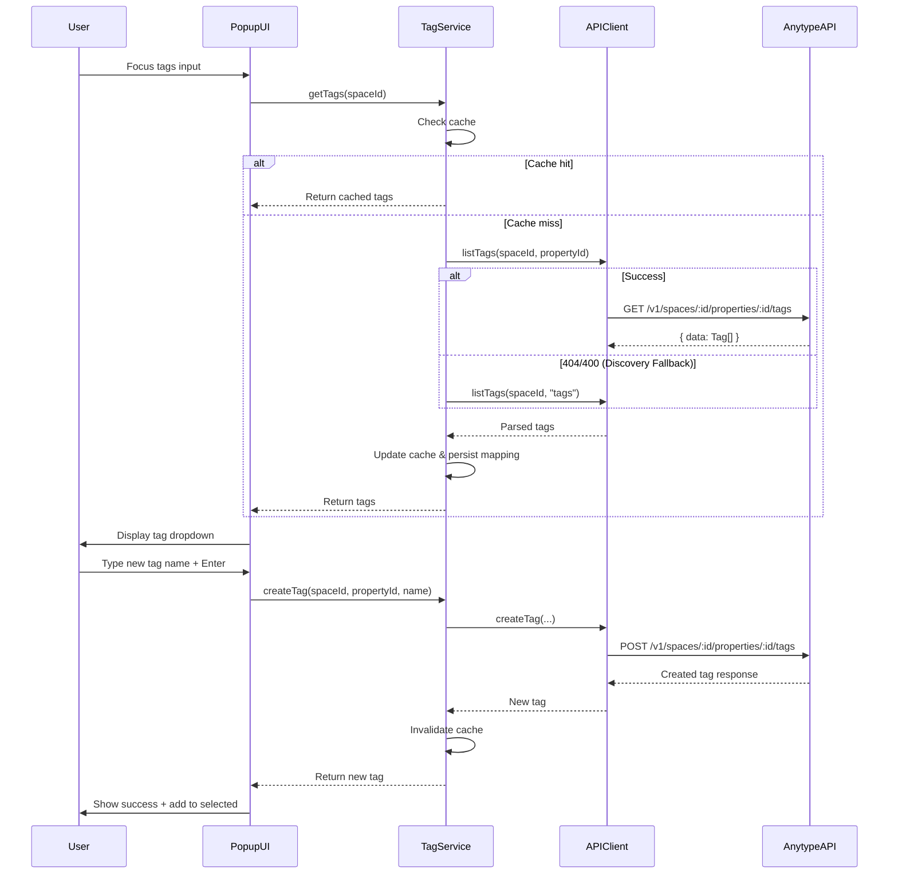

# Implementation Plan: Tag Management Integration

**Spec Reference:** [spec.md](./spec.md)  
**Epic:** Tag Management Integration (Unplanned)  
**Priority:** P1

---

## Architecture Overview

This feature adds tag management capabilities to the Anytype Clipper extension by integrating with the Anytype API's tag endpoints. The implementation consists of three main components:

### 1. API Client Extensions
Extend `AnytypeApiClient` to support tag operations:
- `listTags(spaceId, propertyId, options?)` - Fetch existing tags with pagination
- `createTag(spaceId, propertyId, tagData)` - Create new tags

### 2. Tag Service Layer
Create a new `TagService` class to handle:
- Tag list caching (per space)
- Property ID resolution for different object types
- Tag creation with validation
- Error handling and retry logic
- Cache invalidation on tag creation

### 3. UI Component
Enhance the popup UI with a tag autocomplete component:
- Dropdown/autocomplete interface
- Multi-select tag chips
- Inline tag creation
- Loading and error states
- Keyboard and mouse navigation

### Component Interaction Flow



### Key Design Decisions

**1. Property ID Resolution Strategy**
- **Decision:** Use a hybrid approach:
  - Hardcode known property IDs for common types (Bookmark, Highlight)
  - Provide a fallback mechanism to search object type schemas
  - Allow manual override via configuration
- **Rationale:** Balances simplicity with flexibility. Most users will use standard types, but power users can customize.
- **Alternative considered:** Dynamic schema inspection only - rejected due to complexity and potential performance impact.

**2. Caching Strategy**
- **Decision:** Cache tag lists per space with session-based TTL (until popup closes) and invalidate on tag creation
- **Rationale:** Minimizes API calls while ensuring data freshness. Tag lists don't change frequently.
- **Alternative considered:** No caching - rejected due to poor performance and unnecessary API load.

**3. UI Component Choice**
- **Decision:** Build a custom autocomplete component using vanilla JavaScript
- **Rationale:** Maintains consistency with existing codebase, no external dependencies, full control over behavior.
- **Alternative considered:** Use a library like Choices.js or Tagify - rejected to avoid bundle size increase and maintain simplicity.

**4. Error Handling Strategy**
- **Decision:** Graceful degradation - allow users to proceed with manual tag entry if API fails
- **Rationale:** Tag management is a UX enhancement, not a blocker for core capture functionality.
- **Alternative considered:** Block capture on tag errors - rejected as too restrictive.

---

## Data Contracts

### API Request/Response Types

```typescript
// Tag list request
interface ListTagsRequest {
  spaceId: string;
  propertyId: string;
  offset?: number;
  limit?: number;
  filters?: Record<string, any>; // e.g., { "name[contains]": "urgent" }
}

// Tag list response
interface ListTagsResponse {
  data: Tag[];
  pagination: {
    has_more: boolean;
    limit: number;
    offset: number;
    total: number;
  };
}

interface Tag {
  id: string;
  name: string;
  color: string;
  key?: string;
  object?: "tag";
}

// Create tag request
interface CreateTagRequest {
  Name: string;   // NOTE: Capitalized as per Anytype API requirements
  Color: string;  // NOTE: Capitalized as per Anytype API requirements
}

// Create tag response
interface CreateTagResponse {
  tag: Tag;
}
```

### Storage Schema Extensions

```typescript
// Extend existing storage schema
interface ExtensionStorage {
  // ... existing fields ...
  
  tagCache?: {
    [spaceId: string]: {
      tags: Tag[];
      timestamp: number;
      propertyId: string;
    };
  };
  
  tagPropertyMappings?: {
    [objectType: string]: string; // objectType -> propertyId
  };
}
```

---

## Storage and Persistence

### Tag Cache
- **Location:** `chrome.storage.local` under `tagCache` key
- **Structure:** Map of space ID to cached tag data
- **TTL:** Session-based (cleared on popup close or after 5 minutes of inactivity)
- **Invalidation:** On tag creation, clear cache for that space

### Property ID Mappings
- **Location:** `chrome.storage.local` under `tagPropertyMappings` key
- **Structure:** Map of object type to property ID
- **Persistence:** Long-term (survives browser restart)
- **Updates:** When new property IDs are discovered or manually configured

---

## External Integrations

### Anytype API Endpoints

**1. List Tags**
- **Endpoint:** `GET /v1/spaces/:space_id/properties/:property_id/tags`
- **Query Parameters:** `offset`, `limit`, filter conditions
- **Response:** Paginated list of tags with ID, name, color
- **Error Codes:** 401 (Unauthorized), 404 (Property not found), 500 (Server error)

**2. Create Tag**
- **Endpoint:** `POST /v1/spaces/:space_id/properties/:property_id/tags`
- **Request Body:** `{ "name": "string", "color": "string" }`
- **Response:** Created tag object
- **Error Codes:** 400 (Bad request), 401 (Unauthorized), 429 (Rate limit), 500 (Server error)

### Rate Limiting Considerations
- Tag creation is subject to rate limiting (exact limits TBD)
- Implement exponential backoff: 1s, 2s, 4s, 8s
- Show user-friendly error messages on rate limit errors
- Allow queuing tag creation for retry

---

## UX and Operational States

### Tag Input States

1. **Initial State**
   - Tags input field is empty
   - No dropdown visible
   - Placeholder text: "Add tags..."

2. **Loading State**
   - User focuses on tags input
   - Spinner/loading indicator appears
   - Dropdown shows "Loading tags..."
   - Input is enabled (user can still type)

3. **Loaded State**
   - Dropdown displays list of existing tags
   - Tags are searchable/filterable by typing
   - Keyboard navigation enabled (arrow keys, Enter, Escape)

4. **Tag Selected State**
   - Selected tag appears as a chip/badge below input
   - Tag has an "X" button to remove
   - Tag is removed from dropdown options (or marked as selected)

5. **Creating New Tag State**
   - User types a tag name not in the list
   - "Create new tag: [name]" option appears in dropdown
   - User presses Enter or clicks the option
   - Loading indicator appears on the option
   - On success, tag is added to selected tags and dropdown

6. **Error State**
   - Error message appears below input (e.g., "Failed to load tags. Retry?")
   - Retry button or link
   - Input remains functional for manual tag entry
   - User can proceed with capture

### Tag Autocomplete Behavior

- **Filtering:** Client-side filtering as user types (case-insensitive, substring match)
- **Sorting:** Alphabetical by default, recently used tags at top (future enhancement)
- **Pagination:** Load more tags on scroll if total > 50
- **Keyboard Navigation:**
  - Arrow Up/Down: Navigate dropdown options
  - Enter: Select highlighted option or create new tag
  - Escape: Close dropdown
  - Backspace (empty input): Remove last selected tag
- **Mouse Navigation:**
  - Click to select tag
  - Click "X" to remove selected tag
  - Click outside dropdown to close

---

## Testing Plan

### Unit Tests

**TagService Tests** (`src/lib/tags/tag-service.test.ts`)
- ✅ `getTags()` fetches tags from API when cache is empty
- ✅ `getTags()` returns cached tags when cache is valid
- ✅ `getTags()` invalidates cache after TTL expires
- ✅ `createTag()` calls API and invalidates cache
- ✅ `createTag()` validates tag name (non-empty, max length)
- ✅ Error handling for API failures (network, 404, 500)
- ✅ Rate limit handling with exponential backoff

**API Client Tests** (`src/lib/api/client.test.ts`)
- ✅ `listTags()` constructs correct API request
- ✅ `listTags()` handles pagination parameters
- ✅ `createTag()` sends correct request body
- ✅ Error parsing for tag API responses

**UI Component Tests** (`src/popup/tag-autocomplete.test.ts`)
- ✅ Dropdown displays tags on focus
- ✅ Filtering works correctly as user types
- ✅ Keyboard navigation (arrow keys, Enter, Escape)
- ✅ Tag selection adds chip and removes from dropdown
- ✅ Tag removal works correctly
- ✅ "Create new tag" option appears for unknown tags
- ✅ Loading and error states render correctly

### Integration Tests

**Tag Management Flow** (`tests/integration/tag-management.test.ts`)
- ✅ End-to-end flow: Load tags → Select tag → Save bookmark → Verify in Anytype
- ✅ End-to-end flow: Load tags → Create new tag → Select tag → Save bookmark → Verify in Anytype
- ✅ Error recovery: API failure → Retry → Success
- ✅ Cache invalidation: Create tag → Reload popup → Verify new tag appears

### Manual Verification

**Test Scenarios:**
1. **Happy Path - Existing Tags**
   - Open popup with authenticated session
   - Focus tags input
   - Verify tags load within 2 seconds
   - Select 2-3 existing tags
   - Save bookmark
   - Verify tags appear in Anytype Desktop

2. **Happy Path - New Tag Creation**
   - Open popup
   - Focus tags input
   - Type a new tag name (e.g., "test-tag-123")
   - Press Enter
   - Verify "Creating tag..." indicator
   - Verify success message
   - Verify tag appears in selected tags
   - Save bookmark
   - Verify tag appears in Anytype Desktop

3. **Error Handling - API Unavailable**
   - Stop Anytype Desktop
   - Open popup
   - Focus tags input
   - Verify error message appears
   - Verify user can still type tags manually
   - Verify user can save bookmark with manual tags

4. **Performance - Large Tag List**
   - Create workspace with 100+ tags
   - Open popup
   - Focus tags input
   - Verify tags load within 2 seconds
   - Verify autocomplete filtering is responsive
   - Verify scrolling works smoothly

5. **Multi-Space Support**
   - Switch to different space in popup
   - Focus tags input
   - Verify tags for new space are loaded
   - Verify cache is per-space (different tags for different spaces)

---

## AC Verification Mapping

| Acceptance Criteria | Verification Method | Test Location |
|---------------------|---------------------|---------------|
| AC-U1: Tag List Display | Manual testing + Unit tests | `tag-service.test.ts`, Manual scenario 1 |
| AC-U2: Tag Selection | Manual testing + UI tests | `tag-autocomplete.test.ts`, Manual scenario 1 |
| AC-U3: Inline Tag Creation | Manual testing + Integration tests | `tag-management.test.ts`, Manual scenario 2 |
| AC-U4: Error Handling | Manual testing + Unit tests | `tag-service.test.ts`, Manual scenario 3 |
| AC-U5: Integration with Capture Flows | Manual testing + Integration tests | `tag-management.test.ts`, Manual scenarios 1-2 |

---

## Risks and Mitigations

### Risk 1: Property ID Discovery Complexity
**Mitigation Plan:**
- Phase 1: Hardcode property IDs for Bookmark and Highlight types
- Phase 2: Add property ID discovery via object type schemas (if needed)
- Fallback: Allow users to manually configure property ID in options page

### Risk 2: Rate Limiting Impact
**Mitigation Plan:**
- Implement exponential backoff with clear user feedback
- Cache aggressively to minimize API calls
- Batch tag creation if possible (check API support)
- Document rate limits and best practices

### Risk 3: Large Tag List Performance
**Mitigation Plan:**
- Implement pagination (load 50 tags initially, more on scroll)
- Use virtual scrolling for dropdown (if needed)
- Client-side filtering to narrow results quickly
- Consider lazy loading tags only when input is focused

---

## Rollout and Migration Notes

### Rollout Plan
1. **Phase 1:** Deploy API client extensions and tag service (no UI changes)
2. **Phase 2:** Deploy tag autocomplete UI for bookmark capture only
3. **Phase 3:** Extend to highlight capture and other capture types
4. **Phase 4:** Add advanced features (tag color selection, usage stats, etc.)

### Migration Considerations
- No data migration required (new feature)
- Existing tag input behavior remains unchanged until user focuses input
- Backward compatible with older Anytype API versions (graceful degradation)

### Feature Flag (Optional)
- Consider adding a feature flag to enable/disable tag management
- Allows rollback without code changes if issues arise
- Can be controlled via extension options page

---

## Observability and Debugging

### Logging Strategy

**What to Log:**
- Tag API requests (endpoint, space ID, property ID) - without sensitive data
- Tag API responses (success/failure, error codes) - without tag content
- Cache hits/misses
- Tag creation attempts and results
- Error conditions and retry attempts

**What NOT to Log:**
- Tag names or content (may contain sensitive information)
- Full API responses (may contain user data)
- API keys or authentication tokens

**Log Levels:**
- `DEBUG`: Cache operations, API request details
- `INFO`: Tag creation success, cache invalidation
- `WARN`: API errors, rate limiting, retry attempts
- `ERROR`: Unrecoverable errors, unexpected API responses

### Debug Tools
- Console logging (development mode only)
- Storage inspection via Chrome DevTools
- Network tab for API request monitoring
- Future: Debug log viewer in options page (post-MVP)

---

## Open Questions Resolution

### Q1: Property ID Discovery Approach
**Decision:** Use hardcoded property IDs for common types with fallback to manual configuration.  
**Rationale:** Simplest approach for MVP, can be enhanced later if needed.  
**Implementation:** Create a `TAG_PROPERTY_IDS` constant map in `src/lib/utils/constants.ts`.

### Q2: Tag Color Handling
**Decision:** Use API default colors, don't allow color selection in extension.  
**Rationale:** Reduces UI complexity, users can change colors in Anytype Desktop if needed.  
**Implementation:** Omit `color` field in create tag requests, display colors in autocomplete dropdown.

### Q3: Caching Strategy
**Decision:** Session-based cache with 5-minute TTL, invalidate on tag creation.  
**Rationale:** Balances performance and data freshness.  
**Implementation:** Store timestamp with cache, check TTL on retrieval.

### Q4: Multi-Space Support
**Decision:** Fetch tags lazily when tags input is focused, cache per space.  
**Rationale:** Minimizes unnecessary API calls, ensures correct tags for current space.  
**Implementation:** Pass current space ID to `TagService.getTags()`, maintain separate cache entries per space.

---

**End of plan.md**
