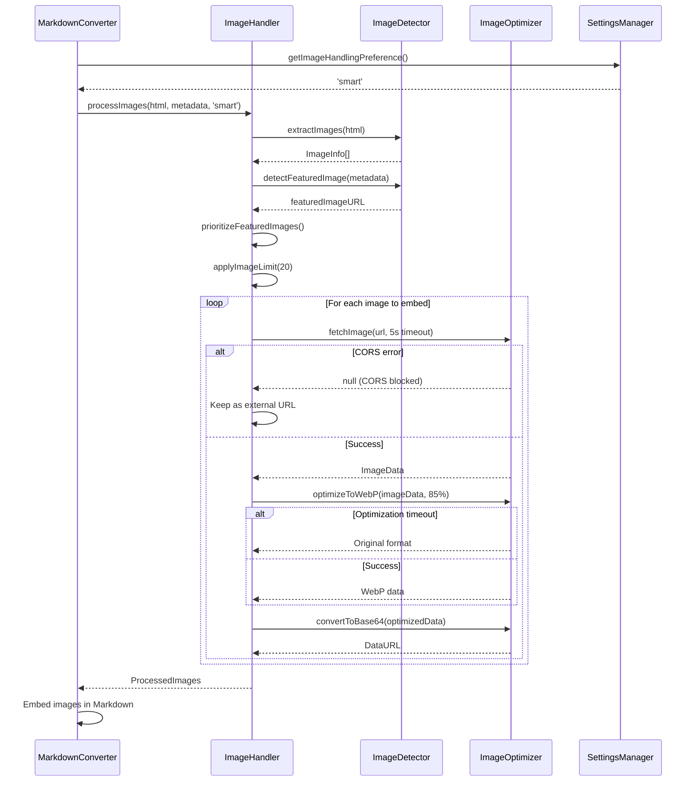

# Implementation Plan: Image Handling

**Epic:** 4.3 - Image Handling  
**Spec:** [spec.md](file:///mnt/Storage/Documents/Projects/AnyType-Clipper/specs/043-image-handling/spec.md)  
**Dependencies:** Epic 4.1 (Markdown Conversion), Epic 3.2 (Metadata Extraction)

---

## Architecture Overview

### Key Components

1. **ImageHandler** (new module)
   - Orchestrates image processing workflow
   - Applies user preferences and size thresholds
   - Enforces 20 image limit
   - Integrates with MarkdownConverter

2. **ImageOptimizer** (new module)
   - Fetches images from URLs
   - Converts to WebP format at 85% quality
   - Handles CORS errors gracefully
   - Manages performance timeouts

3. **ImageDetector** (new module)
   - Extracts images from HTML
   - Identifies featured/hero images from metadata
   - Detects image dimensions and file size
   - Prioritizes critical images

4. **SettingsManager** (existing, extend)
   - Stores user image handling preference
   - Provides default "Smart" mode
   - Validates preference values

### Module Responsibilities

```
ImageHandler
├── processImages(html, metadata, preference) → ProcessedImages
├── applyImageLimit(images, limit) → LimitedImages
└── prioritizeFeaturedImages(images, metadata) → PrioritizedImages

ImageOptimizer
├── fetchImage(url, timeout) → ImageData | null
├── optimizeToWebP(imageData, quality) → OptimizedData
├── convertToBase64(imageData) → DataURL
└── handleCORSError(error) → ExternalURL

ImageDetector
├── extractImages(html) → ImageInfo[]
├── detectFeaturedImage(metadata) → ImageURL | null
├── estimateImageSize(url) → number | null
└── getImageDimensions(imageData) → Dimensions

SettingsManager (extended)
├── getImageHandlingPreference() → 'always' | 'smart' | 'never'
└── setImageHandlingPreference(value) → void
```

### Message Flow



### Alternatives Considered

**Alternative 1: Always embed all images**
- **Pros:** Guaranteed offline access, no broken links
- **Cons:** Creates massive objects, violates 5MB capture limit, slow processing
- **Decision:** Rejected - violates performance and size constraints

**Alternative 2: Never embed, always use external URLs**
- **Pros:** Fast processing, small object sizes
- **Cons:** Broken links when sources go offline, poor offline experience
- **Decision:** Rejected - doesn't meet user needs for preservation

**Alternative 3: Upload images to Anytype storage**
- **Pros:** Best of both worlds - preserved images without bloat
- **Cons:** Requires Anytype API support (not available in MVP)
- **Decision:** Deferred to post-MVP

**Chosen Approach: Smart embedding with user preferences**
- Balances offline access with object size
- Provides flexibility through user preferences
- Handles edge cases gracefully (CORS, timeouts)
- Meets performance budget

---

## Data Contracts

### ImageInfo Interface

```typescript
interface ImageInfo {
  url: string;              // Original image URL
  alt?: string;             // Alt text from HTML
  isFeatured: boolean;      // True if og:image or article:image
  estimatedSize?: number;   // Estimated file size in bytes
  dimensions?: {
    width: number;
    height: number;
  };
}
```

### ProcessedImage Interface

```typescript
interface ProcessedImage {
  originalUrl: string;
  embedType: 'base64' | 'external';
  dataUrl?: string;         // Present if embedType === 'base64'
  format: 'webp' | 'jpeg' | 'png' | 'gif' | 'svg' | 'original';
  alt?: string;
  isFeatured: boolean;
  processingTime?: number;  // Time taken to process (ms)
  error?: string;           // Error message if processing failed
}
```

### ImageHandlingPreference Type

```typescript
type ImageHandlingPreference = 'always' | 'smart' | 'never';

interface ImageHandlingSettings {
  preference: ImageHandlingPreference;
  sizeThreshold: number;    // Default: 500KB (512000 bytes)
  maxEmbeddedImages: number; // Default: 20
  webpQuality: number;      // Default: 85 (0-100)
  fetchTimeout: number;     // Default: 5000ms
}
```

---

## Storage and Persistence

### Settings Storage

**Key:** `imageHandlingSettings`  
**Location:** `chrome.storage.local`  
**Schema:**

```typescript
{
  imageHandlingSettings: {
    preference: 'smart',      // 'always' | 'smart' | 'never'
    sizeThreshold: 512000,    // 500KB in bytes
    maxEmbeddedImages: 20,
    webpQuality: 85,
    fetchTimeout: 5000
  }
}
```

**Default Values:**
- preference: `'smart'`
- sizeThreshold: `512000` (500KB)
- maxEmbeddedImages: `20`
- webpQuality: `85`
- fetchTimeout: `5000` (5s)

---

## External Integrations

None - all image processing is done locally using browser APIs.

---

## UX and Operational States

### Image Processing States

1. **Detecting Images**
   - Extracting images from HTML
   - Identifying featured images from metadata
   - Estimating sizes and dimensions

2. **Fetching Images**
   - Downloading image data from URLs
   - Handling CORS restrictions
   - Managing timeouts

3. **Optimizing Images**
   - Converting to WebP format
   - Compressing to 85% quality
   - Preserving aspect ratio

4. **Embedding Images**
   - Converting to base64 data URLs
   - Inserting into Markdown
   - Tracking embedded count

### Error States

1. **CORS Blocked**
   - Image fetch blocked by CORS policy
   - Fall back to external URL
   - Log sanitized error

2. **Fetch Timeout**
   - Image fetch exceeds 5s timeout
   - Fall back to external URL
   - Continue with remaining images

3. **Optimization Timeout**
   - WebP conversion exceeds 2s timeout
   - Use original format
   - Continue processing

4. **Malformed Image Data**
   - Image data corrupted or invalid
   - Fall back to external URL
   - Log error for debugging

### User Feedback

- **Success:** "Article captured with X embedded images"
- **Partial Success:** "Article captured (some images kept as links due to CORS)"
- **All External:** "Article captured (images kept as external links)"

---

## Testing Plan

### Unit Tests

**File:** `tests/unit/image-handler.test.ts`

1. **Test: Size-based embedding logic**
   - Mock images of various sizes (100KB, 400KB, 600KB, 1MB)
   - Verify <500KB embedded, >500KB external
   - Verify featured images always embedded

2. **Test: Image limit enforcement**
   - Mock article with 30 images
   - Verify only 20 embedded
   - Verify featured images prioritized

3. **Test: User preference application**
   - Test 'always', 'smart', 'never' modes
   - Verify correct embedding behavior for each

4. **Test: CORS error handling**
   - Mock CORS-blocked fetch
   - Verify fallback to external URL
   - Verify no crash or exception

5. **Test: WebP optimization**
   - Mock JPEG and PNG images
   - Verify WebP conversion
   - Verify 85% quality setting
   - Verify aspect ratio preserved

6. **Test: SVG preservation**
   - Mock SVG image
   - Verify no WebP conversion
   - Verify SVG markup preserved

7. **Test: Timeout handling**
   - Mock slow image fetch (>5s)
   - Mock slow WebP conversion (>2s)
   - Verify timeouts trigger fallbacks

**File:** `tests/unit/image-optimizer.test.ts`

1. **Test: Base64 conversion**
   - Mock image data
   - Verify valid base64 data URL output
   - Verify correct MIME type

2. **Test: Image format detection**
   - Test JPEG, PNG, GIF, WebP, SVG
   - Verify correct format identification

3. **Test: Dimension detection**
   - Mock images with various dimensions
   - Verify correct width/height extraction

**File:** `tests/unit/image-detector.test.ts`

1. **Test: Image extraction from HTML**
   - Mock HTML with various  tags
   - Verify all images extracted
   - Verify alt text captured

2. **Test: Featured image detection**
   - Mock metadata with og:image
   - Mock metadata with article:image
   - Verify correct featured image identified

3. **Test: Size estimation**
   - Mock various image URLs
   - Verify size estimation logic

### Integration Tests

**File:** `tests/integration/article-with-images.test.ts`

1. **Test: End-to-end article capture with images**
   - Use sample article HTML with mixed image sizes
   - Verify correct embedding based on size
   - Verify Markdown output includes images
   - Verify featured image embedded

2. **Test: CORS-restricted images**
   - Use test server with CORS restrictions
   - Verify graceful fallback to external URLs
   - Verify capture completes successfully

3. **Test: Image preference integration**
   - Set preference to 'never'
   - Capture article with images
   - Verify all images external
   - Change to 'always'
   - Verify all images embedded (up to 20)

4. **Test: Performance with multiple images**
   - Article with 15 images
   - Verify processing completes within 30s
   - Verify each image <2s optimization time

### Manual Verification

1. **Test: Real-world article capture**
   - Capture article from Medium, Dev.to, or technical blog
   - Verify images appear correctly in Anytype
   - Verify embedded images render
   - Verify external images have valid links

2. **Test: Featured image embedding**
   - Capture article with large og:image (>500KB)
   - Verify featured image embedded despite size
   - Verify WebP optimization applied

3. **Test: Preference settings**
   - Open options page
   - Change image handling preference
   - Capture article
   - Verify preference applied

4. **Test: CORS handling**
   - Capture article with images from restrictive domains
   - Verify capture completes
   - Verify CORS errors logged (check console)
   - Verify fallback to external URLs

---

## AC Verification Mapping

| AC | Verification Method | Test Location |
|----|---------------------|---------------|
| AC-1: Size-based embedding | Unit test | `tests/unit/image-handler.test.ts` |
| AC-2: Featured images embedded | Integration test | `tests/integration/article-with-images.test.ts` |
| AC-3: CORS errors handled | Integration test | `tests/integration/article-with-images.test.ts` |
| AC-4: Image limit enforced | Unit test | `tests/unit/image-handler.test.ts` |
| AC-5: User preferences applied | Integration test | `tests/integration/article-with-images.test.ts` |
| AC-6: Performance budget met | Integration test | `tests/integration/article-with-images.test.ts` |
| AC-7: WebP optimization works | Unit test | `tests/unit/image-handler.test.ts` |
| AC-8: SVG images preserved | Unit test | `tests/unit/image-handler.test.ts` |

---

## Risks and Mitigations

### Technical Risks

1. **WebP conversion performance**
   - **Mitigation:** Implement 2s timeout, fall back to original format
   - **Monitoring:** Track optimization times in tests

2. **CORS restrictions**
   - **Mitigation:** Robust error detection, immediate fallback
   - **Monitoring:** Log CORS failures (sanitized)

3. **Memory usage**
   - **Mitigation:** Process images sequentially, release memory after processing
   - **Monitoring:** Test with 20+ images

4. **Service worker termination**
   - **Mitigation:** Atomic operations for image processing
   - **Monitoring:** Test with service worker restarts

### Integration Risks

1. **Markdown converter compatibility**
   - **Mitigation:** Test with existing Turndown integration
   - **Monitoring:** Verify image syntax in Markdown output

2. **Metadata extraction dependency**
   - **Mitigation:** Handle missing metadata gracefully
   - **Monitoring:** Test with articles lacking og:image

---

## Rollout and Migration Notes

### New Settings

- Add `imageHandlingSettings` to storage schema
- Provide default values on first run
- No migration needed (new feature)

### Backward Compatibility

- No breaking changes to existing captures
- New feature, no impact on existing functionality

### Feature Flag

Not required - feature is self-contained and can be enabled immediately

---

## Observability and Debugging

### What Can Be Logged

- Image processing start/end timestamps
- Number of images detected, embedded, external
- CORS errors (sanitized URLs)
- Optimization timeouts
- WebP conversion success/failure rates
- Performance metrics (time per image)
- User preference changes

### What Must Never Be Logged

- Full image data or base64 strings
- Complete image URLs (sanitize to domain only)
- User's browsing history
- API keys or tokens
- Personal identifiable information

### Debug Information

```typescript
interface ImageProcessingDebugInfo {
  totalImages: number;
  embeddedImages: number;
  externalImages: number;
  featuredImagesEmbedded: number;
  corsErrors: number;
  optimizationTimeouts: number;
  totalProcessingTime: number;
  averageTimePerImage: number;
  preference: ImageHandlingPreference;
}
```

---

## Implementation Phases

### Phase 1: Core Image Processing (T1-T5)
- Implement ImageDetector
- Implement ImageOptimizer
- Implement ImageHandler
- Add unit tests

### Phase 2: Integration (T6-T8)
- Integrate with MarkdownConverter
- Add settings to SettingsManager
- Add integration tests

### Phase 3: Verification (T9-T12)
- Run unit tests
- Run integration tests
- Manual verification
- Performance testing

### Phase 4: Documentation (T13-T15)
- Update SPECS.md
- Update spec.md with evidence
- Update user documentation

---

**End of Implementation Plan**
