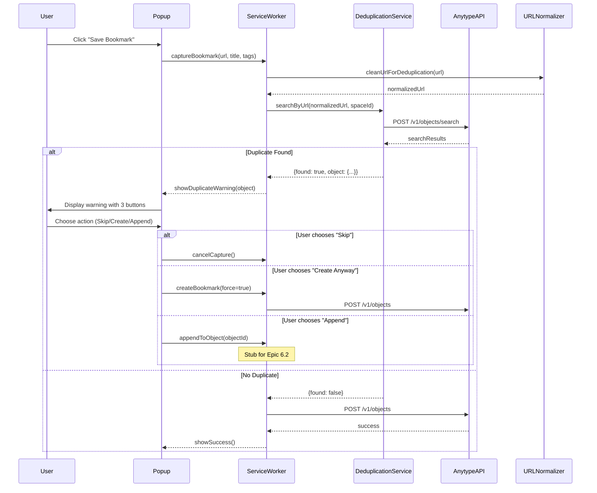

# Implementation Plan: URL Deduplication

**Epic:** 6.0 URL Deduplication  
**Spec:** [spec.md](./spec.md)

---

## Architecture Overview

### Key Components

1. **DeduplicationService** (new)
   - Responsible for searching existing objects by URL
   - Integrates with Anytype API for object search
   - Handles URL normalization before search
   - Returns duplicate detection results

2. **URL Normalizer** (existing)
   - Already implemented in `src/lib/utils/url-normalizer.ts`
   - `cleanUrlForDeduplication()` function handles:
     - Protocol normalization
     - Trailing slash removal
     - Hostname lowercasing
     - Tracking parameter removal
     - Query parameter sorting
     - Fragment removal

3. **Popup UI** (modification)
   - Add duplicate warning component
   - Display existing object info (title, creation date)
   - Provide three action buttons: Skip, Create Anyway, Append to Existing

4. **Service Worker** (modification)
   - Integrate deduplication check into bookmark capture flow
   - Call DeduplicationService before creating object
   - Handle user choice from popup

### Module Boundaries

```
src/
├── background/
│   └── service-worker.ts (modify: integrate deduplication check)
├── lib/
│   ├── services/
│   │   └── deduplication-service.ts (new: search logic)
│   └── utils/
│       └── url-normalizer.ts (existing: already implemented)
└── popup/
    ├── popup.ts (modify: handle duplicate warning)
    └── components/
        └── duplicate-warning.ts (new: UI component)
```

### Call Flow



### Alternatives Considered

**Alternative 1: Client-side caching of all URLs**
- **Pros:** Faster duplicate detection (no API call)
- **Cons:** Memory overhead, stale data, complex cache invalidation
- **Decision:** Rejected. API search is more reliable and handles concurrent updates.

**Alternative 2: Deduplication for all content types (highlights, articles)**
- **Pros:** Comprehensive deduplication
- **Cons:** Increased complexity, different deduplication logic for each type
- **Decision:** Deferred to post-MVP. Start with bookmarks only.

**Alternative 3: Fuzzy matching for similar URLs**
- **Pros:** Catches more duplicates
- **Cons:** False positives, performance overhead, complex algorithm
- **Decision:** Deferred to post-MVP (FR7.8).

---

## Data Contracts

### DeduplicationService Interface

```typescript
interface DeduplicationService {
  /**
   * Search for existing objects by normalized URL
   * @param url - The URL to search for (will be normalized internally)
   * @param spaceId - The Space ID to search within
   * @returns Duplicate detection result
   */
  searchByUrl(url: string, spaceId: string): Promise<DuplicateResult>;
}

interface DuplicateResult {
  found: boolean;
  object?: ExistingObject;
  error?: string;
}

interface ExistingObject {
  id: string;
  title: string;
  url: string;
  createdAt: number;
  spaceId: string;
}
```

### Anytype API Search Request

```typescript
// POST /v1/objects/search
interface SearchRequest {
  spaceId: string;
  filters: {
    property: string;  // "url"
    condition: string; // "equals"
    value: string;     // normalized URL
  }[];
  limit?: number;      // 1 (we only need to know if it exists)
}

interface SearchResponse {
  objects: {
    id: string;
    properties: {
      title: string;
      url: string;
      createdAt: number;
    };
  }[];
}
```

---

## Storage and Persistence

No new storage requirements. Deduplication is stateless and queries Anytype API on-demand.

Optional optimization (post-MVP): Cache recent search results in memory for 5 minutes to avoid redundant API calls.

---

## External Integrations

### Anytype API

**Endpoint:** `POST /v1/spaces/{space_id}/search`

**Request:**
```json
{
  "filters": {
    "operator": "and",
    "conditions": [{
      "property_key": "source",
      "url": "https://example.com",
      "condition": "eq"
    }]
  },
  "types": ["bookmark"],
  "limit": 1
}
```

**Response:**
```json
{
  "data": [
    {
      "id": "obj456",
      "name": "Example Page",
      "properties": [{
        "key": "source",
        "url": "https://example.com"
      }, {
        "key": "created_date",
        "date": "2026-01-04T12:00:00Z"
      }]
    }
  ]
}
```

**Error Handling:**
- 401: Re-authentication needed (handled by existing auth flow)
- 404: Space not found (show error, allow capture to proceed)
- 500: API error (log error, allow capture to proceed)
- Timeout (>1s): Cancel search, allow capture to proceed


---

## UX and Operational States

### State 1: No Duplicate Found
- User clicks "Save Bookmark"
- Deduplication check runs in background (<1s)
- No duplicate found
- Bookmark created immediately
- Success notification shown

### State 2: Duplicate Found
- User clicks "Save Bookmark"
- Deduplication check runs in background (<1s)
- Duplicate found
- Popup shows warning:
  ```
  ⚠️ This URL was already saved
  
  "Example Page"
  Saved on Jan 4, 2026
  
  [Skip] [Create Anyway] [Append to Existing]
  ```
- User chooses action

### State 3: Deduplication Error
- User clicks "Save Bookmark"
- Deduplication check fails (API error, timeout)
- Error logged to console
- Bookmark created anyway (graceful degradation)
- Success notification shown (user unaware of error)

### State 4: Offline Mode
- User clicks "Save Bookmark"
- Anytype is offline
- Deduplication skipped
- Bookmark queued
- Queued notification shown

---

## Testing Plan

### Unit Tests

**Test File:** `tests/unit/deduplication-service.test.ts` (new)

1. **URL Normalization Tests**
   - Test `cleanUrlForDeduplication()` with various URL formats
   - Verify http/https normalization
   - Verify trailing slash removal
   - Verify tracking parameter removal
   - Verify query parameter sorting
   - Verify fragment removal

2. **Duplicate Search Tests**
   - Mock Anytype API search endpoint
   - Test successful duplicate detection
   - Test no duplicate found
   - Test API error handling
   - Test timeout handling
   - Test malformed URL handling

3. **Performance Tests**
   - Verify search completes <1s
   - Verify URL normalization completes <10ms

**Run Command:**
```bash
npm test -- tests/unit/deduplication-service.test.ts
```

### Integration Tests

**Test File:** `tests/integration/deduplication-flow.test.ts` (new)

1. **End-to-End Deduplication Flow**
   - Create bookmark with URL `https://example.com/test`
   - Attempt to create same bookmark again
   - Verify duplicate warning shown
   - Test "Skip" action
   - Test "Create Anyway" action
   - Test "Append" action (stub for Epic 6.2)

2. **URL Variation Tests**
   - Create bookmark with `http://example.com`
   - Attempt `https://example.com` → Verify duplicate detected
   - Create bookmark with `example.com/page`
   - Attempt `example.com/page/` → Verify duplicate detected
   - Create bookmark with `www.example.com`
   - Attempt `example.com` → Verify duplicate detected

**Run Command:**
```bash
npm test -- tests/integration/deduplication-flow.test.ts
```

### Manual Verification

**Test Matrix:** (to be executed by user or tester)

| Test Case | Steps | Expected Result |
|-----------|-------|-----------------|
| TC1: Basic duplicate detection | 1. Save bookmark `https://example.com/test`<br>2. Attempt to save same URL again | Duplicate warning shown with 3 buttons |
| TC2: Skip action | 1. Trigger duplicate warning<br>2. Click "Skip" | Capture cancelled, no new object created |
| TC3: Create anyway | 1. Trigger duplicate warning<br>2. Click "Create Anyway" | New object created despite duplicate |
| TC4: HTTP/HTTPS variation | 1. Save `http://example.com`<br>2. Attempt `https://example.com` | Duplicate detected |
| TC5: Trailing slash | 1. Save `example.com/page`<br>2. Attempt `example.com/page/` | Duplicate detected |
| TC6: WWW variation | 1. Save `www.example.com`<br>2. Attempt `example.com` | Duplicate detected |
| TC7: Tracking params | 1. Save `example.com?utm_source=x&id=1`<br>2. Attempt `example.com?id=1` | Duplicate detected |
| TC8: Fragment | 1. Save `example.com#section`<br>2. Attempt `example.com` | Duplicate detected |
| TC9: Performance | 1. Create 100 bookmarks in Space<br>2. Attempt duplicate | Search completes <1s |
| TC10: Offline mode | 1. Stop Anytype<br>2. Attempt to save bookmark | Deduplication skipped, bookmark queued |
| TC11: API error | 1. Mock API error<br>2. Attempt to save bookmark | Error logged, bookmark created anyway |

---

## AC Verification Mapping

### AC6: Duplicate Detection and Append Option
- **Verified by:** TC1, TC2, TC3 (manual tests)
- **Unit tests:** `deduplication-service.test.ts` - duplicate search tests
- **Integration tests:** `deduplication-flow.test.ts` - end-to-end flow

### AC14: URL Variation Handling
- **Verified by:** TC4, TC5, TC6, TC7, TC8 (manual tests)
- **Unit tests:** `deduplication-service.test.ts` - URL normalization tests
- **Integration tests:** `deduplication-flow.test.ts` - URL variation tests

### AC-U1: Performance Requirement
- **Verified by:** TC9 (manual test)
- **Unit tests:** `deduplication-service.test.ts` - performance tests

### AC-U2: Graceful Degradation
- **Verified by:** TC10, TC11 (manual tests)
- **Unit tests:** `deduplication-service.test.ts` - error handling tests

---

## Risks and Mitigations

### Risk 1: Anytype API search endpoint doesn't exist
- **Mitigation:** Verify API endpoint early (T1). If not available, implement client-side search through existing objects.

### Risk 2: Search performance degrades with large object count
- **Mitigation:** Implement 1s timeout (T2). Add client-side caching (optional). Limit search to current Space.

### Risk 3: False positives in URL normalization
- **Mitigation:** Thorough testing (T12, T13). Conservative normalization rules. Allow "Create Anyway" option.

---

## Rollout and Migration Notes

- No data migration required
- Feature can be enabled immediately after implementation
- Backward compatible (no breaking changes)
- If deduplication fails, capture proceeds normally (graceful degradation)

---

## Observability and Debugging

### What Can Be Logged
- Duplicate detection results (found/not found)
- Search duration (for performance monitoring)
- Normalized URLs (for debugging)
- API errors (sanitized)

### What Must Never Be Logged
- Full URLs in production (privacy concern)
- API keys or tokens
- User-identifiable information

### Debug Commands
- Console log: `[Deduplication] Searching for URL: <normalized-url>`
- Console log: `[Deduplication] Duplicate found: <object-id>`
- Console log: `[Deduplication] Search completed in <duration>ms`
- Console error: `[Deduplication] Search failed: <sanitized-error>`
