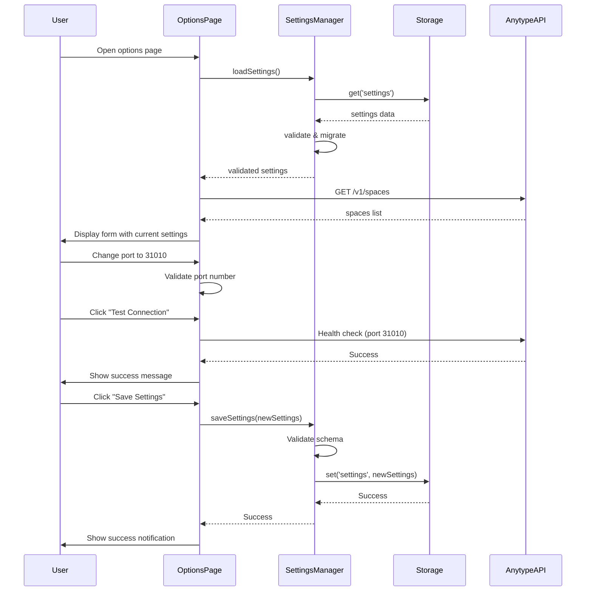

# Implementation Plan: Options Page

**Epic:** 7.2 Options Page  
**Spec:** [spec.md](file:///mnt/Storage/Documents/Projects/AnyType-Clipper/specs/072-options-page/spec.md)

---

## Architecture Overview

### Key Components

#### 1. Options Page UI (`src/options/`)
- **options.html**: Main options page structure
- **options.ts**: Options page logic and event handlers
- **options.css**: Styling for options page
- **components/**: Reusable UI components (if needed)

#### 2. Settings Manager (`src/lib/storage/settings-manager.ts`)
- Centralized settings management
- Schema versioning and validation
- Default settings provider
- Migration logic for schema changes

#### 3. Settings Schema (`src/types/settings.d.ts`)
- TypeScript interfaces for settings structure
- Version metadata
- Validation rules

### Module Responsibilities

```
Options Page UI
├── Render settings form
├── Handle user input
├── Validate form data
├── Fetch Spaces from API
├── Test port connection
└── Trigger clear data operation

Settings Manager
├── Load settings from storage
├── Save settings to storage
├── Validate settings schema
├── Migrate old settings
├── Provide default settings
└── Handle storage errors

Storage Layer (chrome.storage.local)
├── Persist settings
├── Persist API key
├── Persist queue data
└── Persist cached Spaces
```

### Message Flow



---

## Data Contracts

### Settings Schema v1

```typescript
interface Settings {
  version: 1;
  defaultSpaces: {
    bookmark: string | null;  // Space ID or null for "no default"
    highlight: string | null;
    article: string | null;
    note: string | null;
    task: string | null;
  };
  retry: {
    maxAttempts: number;  // 1-20, default: 10
    backoffIntervals: number[];  // Calculated from maxAttempts
  };
  deduplication: {
    enabled: boolean;  // default: true
  };
  api: {
    port: number;  // 1-65535, default: 31009
  };
  images: {
    strategy: 'always' | 'smart' | 'never';  // default: 'smart'
  };
  privacy: {
    mode: boolean;  // default: false
  };
}
```

### Default Settings

```typescript
const DEFAULT_SETTINGS: Settings = {
  version: 1,
  defaultSpaces: {
    bookmark: null,
    highlight: null,
    article: null,
    note: null,
    task: null,
  },
  retry: {
    maxAttempts: 10,
    backoffIntervals: [1000, 5000, 30000, 300000],  // 1s, 5s, 30s, 5m
  },
  deduplication: {
    enabled: true,
  },
  api: {
    port: 31009,
  },
  images: {
    strategy: 'smart',
  },
  privacy: {
    mode: false,
  },
};
```

---

## Storage and Persistence

### Storage Keys
- `settings`: Settings object (versioned schema)
- `apiKey`: API key (existing, not modified)
- `queue`: Queue items (existing, not modified)
- `cachedSpaces`: Cached Spaces list (new, for offline access)

### Storage Operations
- **Load settings**: `chrome.storage.local.get('settings')`
- **Save settings**: `chrome.storage.local.set({ settings: newSettings })`
- **Clear all data**: `chrome.storage.local.clear()`

### Migration Strategy
1. Load settings from storage
2. Check version field
3. If version < current, apply migrations in sequence
4. Save migrated settings
5. Return validated settings

Example migration (v1 → v2 in future):
```typescript
function migrateV1toV2(v1Settings: SettingsV1): SettingsV2 {
  return {
    ...v1Settings,
    version: 2,
    newField: defaultValue,
  };
}
```

---

## External Integrations

### Anytype API Integration

#### Fetch Spaces
- **Endpoint**: `GET /v1/spaces`
- **Purpose**: Populate Space selector dropdowns
- **Error Handling**: Show cached Spaces or error message
- **Caching**: Store fetched Spaces in `chrome.storage.local.cachedSpaces`

#### Test Connection
- **Endpoint**: Health check ping to configured port
- **Purpose**: Verify Anytype is reachable on custom port
- **Timeout**: 5 seconds
- **Error Handling**: Show connection failure message with details

---

## UX and Operational States

### Page States

#### 1. Loading State
- Show loading spinner while fetching settings and Spaces
- Disable form inputs
- Display "Loading settings..."

#### 2. Ready State
- Form populated with current settings
- All inputs enabled
- Space dropdowns populated
- Save button enabled

#### 3. Saving State
- Show saving spinner
- Disable form inputs
- Display "Saving settings..."

#### 4. Error State
- Show error message (inline or toast)
- Keep form enabled for corrections
- Highlight invalid fields

#### 5. Success State
- Show success notification
- Keep form enabled
- Clear any previous errors

### Form Sections

1. **Default Spaces**
   - 5 dropdowns (Bookmark, Highlight, Article, Note, Task)
   - "Refresh Spaces" button
   - Loading state for Space fetching

2. **Retry Behavior**
   - Max attempts input (number)
   - Retry schedule preview (read-only)

3. **Deduplication**
   - Enable/disable checkbox
   - Explanation text

4. **API Configuration**
   - Port number input
   - "Test Connection" button
   - Connection status indicator

5. **Image Handling**
   - Radio buttons (Always, Smart, Never)
   - Explanation for each option

6. **Privacy**
   - Privacy mode checkbox
   - Explanation text

7. **Data Management**
   - "Clear All Data" button (red, warning icon)
   - Confirmation dialog

---

## Testing Plan

### Unit Tests

#### Settings Manager Tests
**File**: `tests/unit/settings-manager.test.ts`

```typescript
describe('SettingsManager', () => {
  test('loads default settings on first run', async () => {
    // Mock empty storage
    // Load settings
    // Expect default settings returned
  });

  test('validates settings schema', () => {
    // Test valid settings pass validation
    // Test invalid settings fail validation
  });

  test('migrates v1 to v2 settings', () => {
    // Mock v1 settings
    // Run migration
    // Expect v2 settings with new fields
  });

  test('handles corrupted settings', async () => {
    // Mock corrupted data in storage
    // Load settings
    // Expect fallback to defaults
  });
});
```

**Run command**: `npm test -- settings-manager.test.ts`

#### Settings Validation Tests
**File**: `tests/unit/settings-validation.test.ts`

```typescript
describe('Settings Validation', () => {
  test('validates port number range', () => {
    expect(validatePort(31009)).toBe(true);
    expect(validatePort(0)).toBe(false);
    expect(validatePort(99999)).toBe(false);
  });

  test('validates max retry attempts', () => {
    expect(validateMaxAttempts(10)).toBe(true);
    expect(validateMaxAttempts(0)).toBe(false);
    expect(validateMaxAttempts(25)).toBe(false);
  });

  test('validates image strategy', () => {
    expect(validateImageStrategy('smart')).toBe(true);
    expect(validateImageStrategy('invalid')).toBe(false);
  });
});
```

**Run command**: `npm test -- settings-validation.test.ts`

### Integration Tests

#### Options Page Integration Tests
**File**: `tests/integration/options-page.test.ts`

```typescript
describe('Options Page Integration', () => {
  test('loads and displays current settings', async () => {
    // Mock storage with settings
    // Load options page
    // Verify form populated correctly
  });

  test('saves settings to storage', async () => {
    // Load options page
    // Change settings
    // Click save
    // Verify storage updated
  });

  test('fetches Spaces from API', async () => {
    // Mock API response
    // Load options page
    // Verify Spaces displayed in dropdowns
  });

  test('tests port connection', async () => {
    // Mock health check API
    // Enter custom port
    // Click "Test Connection"
    // Verify success/failure message
  });

  test('clears all data', async () => {
    // Mock storage with data
    // Click "Clear All Data"
    // Confirm dialog
    // Verify storage cleared
  });
});
```

**Run command**: `npm test -- options-page.test.ts`

### Manual Verification

#### MV-1: Options Page Access
1. Open extension popup
2. Click "Settings" link
3. **Expected**: Options page opens in new tab
4. Navigate to `chrome://extensions`
5. Find Anytype Clipper extension
6. Click "Options"
7. **Expected**: Options page opens in new tab

#### MV-2: Default Space Configuration
1. Open options page
2. Select different Spaces for each content type
3. Click "Save Settings"
4. **Expected**: Success notification shown
5. Open popup
6. Verify default Spaces pre-selected for each capture type
7. Create a bookmark
8. **Expected**: Bookmark saved to configured default Space

#### MV-3: Retry Behavior Configuration
1. Open options page
2. Change max attempts to 5
3. **Expected**: Retry schedule preview updates
4. Click "Save Settings"
5. Close Anytype Desktop
6. Create a capture (will be queued)
7. Monitor queue retries
8. **Expected**: Max 5 retry attempts before marking as failed

#### MV-4: Custom Port Configuration
1. Open options page
2. Change port to 31010 (or another port)
3. Click "Test Connection"
4. **Expected**: Connection failure (if Anytype not on that port)
5. Change port back to 31009
6. Click "Test Connection"
7. **Expected**: Connection success
8. Click "Save Settings"
9. Create a capture
10. **Expected**: Capture works with configured port

#### MV-5: Image Handling Preference
1. Open options page
2. Select "Always embed"
3. Click "Save Settings"
4. Clip an article with large images (>500KB)
5. **Expected**: All images embedded as base64
6. Change to "Never embed"
7. Clip same article
8. **Expected**: All images kept as external URLs

#### MV-6: Privacy Mode
1. Open options page
2. Enable privacy mode
3. Click "Save Settings"
4. Create several captures
5. Check storage for URL history
6. **Expected**: No URL history tracked

#### MV-7: Clear All Data
1. Open options page
2. Click "Clear All Data"
3. **Expected**: Confirmation dialog appears listing what will be deleted
4. Click "Cancel"
5. **Expected**: Dialog closes, no data deleted
6. Click "Clear All Data" again
7. Check confirmation checkbox
8. Click "Confirm"
9. **Expected**: All data cleared, success message shown
10. **Expected**: Redirected to authentication flow

#### MV-8: Form Validation
1. Open options page
2. Enter invalid port (e.g., 99999)
3. **Expected**: Error message shown, save button disabled
4. Enter valid port
5. **Expected**: Error cleared, save button enabled
6. Enter invalid max attempts (e.g., 0)
7. **Expected**: Error message shown, save button disabled

---

## AC Verification Mapping

| AC | Verification Method | Test/Manual Step |
|----|---------------------|------------------|
| AC-1 | Manual | MV-1 |
| AC-2 | Manual | MV-2 |
| AC-3 | Manual | MV-3 |
| AC-4 | Manual | MV-4 (deduplication toggle) |
| AC-5 | Manual | MV-4 |
| AC-6 | Manual | MV-5 |
| AC-7 | Manual | MV-6 |
| AC-8 | Manual | MV-7 |
| AC-9 | Integration | options-page.test.ts + MV-2 (restart browser) |
| AC-10 | Manual | MV-8 |

---

## Risks and Mitigations

### Risk 1: Space Fetching Failure
**Mitigation:**
- Implement caching of last-fetched Spaces
- Show cached Spaces with warning banner if API fails
- Provide "Refresh Spaces" button
- Allow manual Space ID entry as fallback (future enhancement)

### Risk 2: Port Change Breaking Queue
**Mitigation:**
- Check queue status before allowing port change
- Show warning if queue has pending items
- Suggest processing queue first
- Validate new port with test connection before saving

### Risk 3: Settings Schema Migration
**Mitigation:**
- Version schema from v1
- Implement migration logic in SettingsManager
- Validate settings on load with fallback to defaults
- Add migration tests to CI

### Risk 4: Accidental Data Deletion
**Mitigation:**
- Require explicit confirmation (checkbox + button)
- List exactly what will be deleted
- Use warning colors and icons
- Consider adding "Export queue" before clearing (future)

---

## Rollout and Migration Notes

### Initial Rollout
1. Deploy options page with v1 settings schema
2. Initialize default settings on first run
3. Migrate existing users (if any settings exist in different format)
4. Update popup to link to options page

### Future Migrations
- When adding new settings fields, increment version
- Implement migration function in SettingsManager
- Test migration with real user data
- Document migration in changelog

### Backwards Compatibility
- Settings schema v1 is the baseline
- Future versions must support migration from v1
- Never break existing settings without migration path

---

## Observability and Debugging

### What Can Be Logged
- Settings load/save operations (without sensitive data)
- Validation errors (sanitized)
- API fetch errors (without API keys)
- Migration operations (version changes)
- Form validation failures

### What Must Never Be Logged
- API keys
- Full settings object (may contain sensitive data in future)
- User's Space IDs or names
- Port numbers (could be security-sensitive)

### Debug Information
- Settings version
- Migration status (success/failure)
- Validation errors (field names only, not values)
- API availability status

---

## Proposed Changes

### New Files

#### [NEW] [options.html](file:///mnt/Storage/Documents/Projects/AnyType-Clipper/src/options/options.html)
- Main options page structure
- Form sections for all settings
- Confirmation dialog for clear data

#### [NEW] [options.ts](file:///mnt/Storage/Documents/Projects/AnyType-Clipper/src/options/options.ts)
- Options page logic
- Event handlers for form inputs
- Space fetching and caching
- Port connection testing
- Settings save/load
- Clear data operation

#### [NEW] [options.css](file:///mnt/Storage/Documents/Projects/AnyType-Clipper/src/options/options.css)
- Styling for options page
- Form layout and spacing
- Button styles
- Error/success states

#### [NEW] [settings-manager.ts](file:///mnt/Storage/Documents/Projects/AnyType-Clipper/src/lib/storage/settings-manager.ts)
- Centralized settings management
- Schema validation
- Migration logic
- Default settings provider

#### [NEW] [settings.d.ts](file:///mnt/Storage/Documents/Projects/AnyType-Clipper/src/types/settings.d.ts)
- Settings schema TypeScript interfaces
- Validation types
- Version metadata

### Modified Files

#### [MODIFY] [manifest.json](file:///mnt/Storage/Documents/Projects/AnyType-Clipper/src/manifest.json)
- Add `options_page` field pointing to `options.html`

#### [MODIFY] [popup.html](file:///mnt/Storage/Documents/Projects/AnyType-Clipper/src/popup/popup.html)
- Add "Settings" link to footer or header

#### [MODIFY] [popup.ts](file:///mnt/Storage/Documents/Projects/AnyType-Clipper/src/popup/popup.ts)
- Load default Spaces from settings
- Apply configured defaults to Space selectors

#### [MODIFY] [service-worker.ts](file:///mnt/Storage/Documents/Projects/AnyType-Clipper/src/background/service-worker.ts)
- Load settings on startup
- Apply retry behavior from settings
- Apply image handling preference from settings
- Apply privacy mode from settings

#### [MODIFY] [api-client.ts](file:///mnt/Storage/Documents/Projects/AnyType-Clipper/src/background/api-client.ts)
- Load API port from settings
- Use configured port for all API calls

---

## File Structure

```
src/
├── options/
│   ├── options.html          [NEW]
│   ├── options.ts            [NEW]
│   └── options.css           [NEW]
├── lib/
│   └── storage/
│       └── settings-manager.ts  [NEW]
├── types/
│   └── settings.d.ts         [NEW]
├── popup/
│   ├── popup.html            [MODIFY]
│   └── popup.ts              [MODIFY]
├── background/
│   ├── service-worker.ts     [MODIFY]
│   └── api-client.ts         [MODIFY]
└── manifest.json             [MODIFY]

tests/
├── unit/
│   ├── settings-manager.test.ts      [NEW]
│   └── settings-validation.test.ts   [NEW]
└── integration/
    └── options-page.test.ts          [NEW]
```
