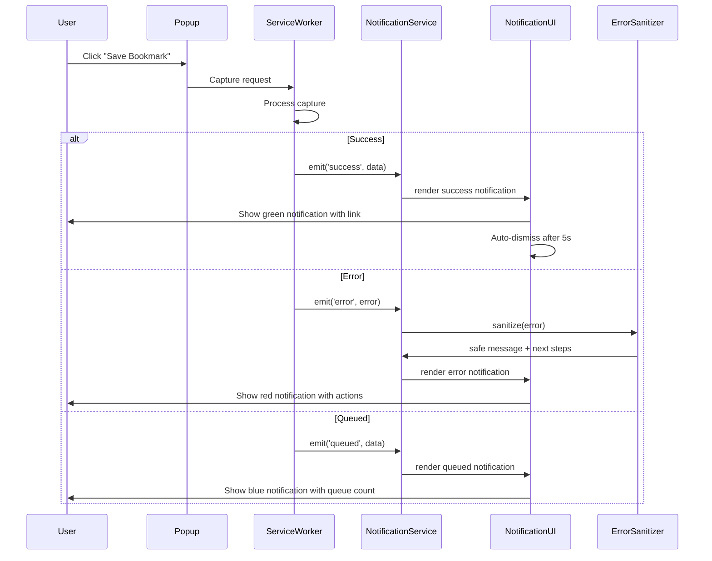

# Implementation Plan: Notifications System

**Spec Reference:** [spec.md](./spec.md)  
**Epic:** 7.3 Notifications System  
**Status:** Planning

---

## Architecture Overview

### Key Components

The Notifications System will be implemented as a reusable notification service integrated into the popup UI. The architecture follows a message-driven pattern where capture operations emit notification events that are rendered in the popup.

**Components:**

1. **NotificationService** (`src/lib/notifications/notification-service.ts`)
   - Centralized notification management
   - Handles notification creation, display, and dismissal
   - Manages notification queue (max 3 visible)
   - Provides type-safe notification API

2. **NotificationUI** (`src/popup/components/notification.ts`)
   - React/vanilla component for rendering notifications
   - Color-coded styling (green, red, yellow, blue)
   - Auto-dismiss timer for success notifications
   - Keyboard navigation support

3. **NotificationTypes** (`src/types/notifications.ts`)
   - TypeScript interfaces for all notification types
   - Notification severity levels (success, error, warning, info)
   - Notification actions (buttons, links)

4. **ErrorSanitizer** (`src/lib/utils/error-sanitizer.ts`)
   - Sanitizes error messages before display
   - Removes stack traces, API keys, PII
   - Maps error types to user-friendly messages

### Message Flow



### Alternatives Considered

**Alternative 1: Toast Notifications (External Library)**
- **Pros:** Rich animations, mature library, less code to write
- **Cons:** Adds dependency, increases bundle size, less control over styling
- **Decision:** Rejected - prefer lightweight custom solution for MVP

**Alternative 2: Browser Notifications API**
- **Pros:** Native OS notifications, works when popup closed
- **Cons:** Requires additional permission, may be intrusive, privacy concerns
- **Decision:** Rejected - keep notifications within extension UI for MVP

**Alternative 3: Inline Notifications (Per-Form)**
- **Pros:** Contextual, close to action
- **Cons:** Harder to manage globally, inconsistent UX
- **Decision:** Rejected - prefer centralized notification system

**Chosen Approach:** Custom notification service with centralized management and popup UI rendering. This provides full control, minimal dependencies, and consistent UX.

---

## Data Contracts

### Notification Interface

```typescript
interface Notification {
  id: string;                    // Unique notification ID (UUID)
  type: NotificationType;        // success | error | warning | info
  severity: NotificationSeverity; // low | medium | high
  title: string;                 // Main message
  message?: string;              // Optional detailed message
  actions?: NotificationAction[]; // Optional buttons
  link?: NotificationLink;       // Optional deep link
  autoDismiss?: number;          // Auto-dismiss delay (ms), default 5000 for success
  timestamp: number;             // Creation timestamp
  metadata?: Record<string, unknown>; // Additional data
}

type NotificationType = 'success' | 'error' | 'warning' | 'info';
type NotificationSeverity = 'low' | 'medium' | 'high';

interface NotificationAction {
  label: string;                 // Button text
  action: string;                // Action identifier
  primary?: boolean;             // Primary button styling
}

interface NotificationLink {
  url: string;                   // Deep link or instruction
  label: string;                 // Link text
  external?: boolean;            // Open in new tab (for anytype://)
}
```

### Notification Events

```typescript
// Event emitted by service worker
interface NotificationEvent {
  type: 'notification:create';
  payload: Notification;
}

// Event emitted by UI
interface NotificationDismissEvent {
  type: 'notification:dismiss';
  payload: { id: string };
}

interface NotificationActionEvent {
  type: 'notification:action';
  payload: { id: string; action: string };
}
```

---

## Storage and Persistence

### Notification State (In-Memory Only)

Notifications are **not persisted** to chrome.storage.local. They are ephemeral and exist only while the popup is open.

**Rationale:**
- Notifications are time-sensitive feedback, not historical data
- Persisting notifications adds complexity without clear user benefit
- Error states are already tracked in queue (for failed captures)

**Exception:** Re-authentication notifications may need to persist across popup reopens until re-auth completes. This will be stored as a flag in chrome.storage.local:

```typescript
interface StorageSchema {
  // ... existing fields
  notifications: {
    reauthRequired?: boolean;  // Flag for persistent re-auth notification
  };
}
```

---

## External Integrations

### Anytype Deep Links

**Requirement:** Success notifications should include a link to view the captured object in Anytype.

**Implementation:**
1. Check if Anytype supports `anytype://` protocol (research needed)
2. If supported, construct deep link: `anytype://object/{objectId}`
3. If not supported, show instructional text: "Open Anytype to view your capture"

**Fallback:** If deep links are not available, provide object ID in notification for manual search.

---

## UX and Operational States

### Notification Display States

1. **Visible** - Notification is displayed in popup
2. **Dismissing** - Fade-out animation in progress (300ms)
3. **Dismissed** - Notification removed from DOM

### Notification Queue Management

- **Max visible notifications:** 3
- **Queue behavior:** FIFO (oldest dismissed first when new notification arrives)
- **Auto-dismiss:** Success notifications auto-dismiss after 5 seconds
- **Manual dismiss:** All notifications can be manually dismissed via close button or Escape key

### Notification Types and Styling

| Type    | Color  | Icon       | Auto-Dismiss | Use Case                          |
|---------|--------|------------|--------------|-----------------------------------|
| Success | Green  | Checkmark  | 5s           | Capture succeeded                 |
| Error   | Red    | Error      | Manual       | Capture failed, re-auth needed    |
| Warning | Yellow | Warning    | Manual       | Duplicate detected, quality issue |
| Info    | Blue   | Info       | 5s           | Queued, background processing     |

---

## Testing Plan

### Unit Tests

**File:** `tests/unit/notification-service.test.ts`

- Test notification creation with all types (success, error, warning, info)
- Test auto-dismiss timer for success notifications
- Test manual dismiss
- Test notification queue (max 3 visible)
- Test error sanitization (remove stack traces, API keys)
- Test notification action handling

**File:** `tests/unit/error-sanitizer.test.ts`

- Test sanitization of various error types (AuthError, NetworkError, APIError)
- Test removal of sensitive data (API keys, tokens, PII)
- Test user-friendly message mapping
- Test next steps generation

**Run command:**
```bash
npm test -- notification-service.test.ts error-sanitizer.test.ts
```

### Integration Tests

**File:** `tests/integration/notification-flow.test.ts`

- Test success notification flow (capture → notification → auto-dismiss)
- Test error notification flow (capture fails → error notification → manual dismiss)
- Test queued notification flow (Anytype offline → queued notification)
- Test duplicate warning flow (duplicate detected → warning → user choice)
- Test re-auth notification flow (401 → re-auth notification → queue captures)

**Run command:**
```bash
npm test -- notification-flow.test.ts
```

### Manual Verification

**Test 1: Success Notification**
1. Load extension in Brave browser
2. Open popup and capture a bookmark
3. Verify green success notification appears with:
   - "Bookmark saved" message
   - Link to view in Anytype (or instruction)
   - Auto-dismisses after 5 seconds
4. Verify notification can be manually dismissed via close button
5. Verify notification can be dismissed via Escape key

**Test 2: Error Notification**
1. Stop Anytype Desktop
2. Open popup and attempt to capture a bookmark
3. Verify red error notification appears with:
   - "Anytype is not running" message
   - "Start Anytype Desktop and try again" next step
   - "View Queue" button
4. Verify notification persists until manually dismissed
5. Click "View Queue" and verify queue UI opens

**Test 3: Extraction Quality Feedback**
1. Capture an article with good structure (e.g., blog post)
2. Verify green notification: "Article captured (X words)"
3. Capture a complex SPA page (e.g., Twitter)
4. Verify yellow notification: "Article captured (simplified)"
5. Capture a page that fails all extraction (e.g., login page)
6. Verify orange notification: "Saved as bookmark - extraction failed"

**Test 4: Duplicate Detection Warning**
1. Capture a bookmark (e.g., https://example.com)
2. Attempt to capture the same URL again
3. Verify warning appears in popup with:
   - "This URL was already captured" message
   - Existing object title and date
   - Buttons: Skip, Create Anyway, Append
4. Click "Skip" and verify capture is cancelled
5. Attempt again and click "Create Anyway" - verify duplicate is created
6. Attempt again and click "Append" - verify content is appended

**Test 5: Keyboard Navigation**
1. Open popup and trigger a notification
2. Press Tab - verify focus moves to notification buttons
3. Press Enter - verify button action executes
4. Trigger another notification
5. Press Escape - verify notification dismisses
6. Verify focus returns to previous element

**Test 6: Screen Reader Support**
1. Enable screen reader (NVDA on Windows, Orca on Linux)
2. Trigger success notification
3. Verify screen reader announces: "Success: Bookmark saved"
4. Trigger error notification
5. Verify screen reader announces: "Error: Anytype is not running"
6. Verify notification type is identified (success, error, warning, info)

---

## AC Verification Mapping

| AC ID  | Verification Method                                  | Evidence Location              |
|--------|------------------------------------------------------|--------------------------------|
| AC-N1  | Manual Test 1 (Success Notification)                | spec.md#evidence               |
| AC-N2  | Manual Test 2 (Error Notification)                  | spec.md#evidence               |
| AC-N3  | Manual Test 3 (Extraction Quality Feedback)         | spec.md#evidence               |
| AC-N4  | Integration test + Manual verification              | spec.md#evidence               |
| AC-N5  | Manual Test 4 (Duplicate Detection Warning)         | spec.md#evidence               |
| AC-N6  | Integration test + Manual verification              | spec.md#evidence               |
| AC-N7  | Manual Test 5 (Keyboard Navigation)                 | spec.md#evidence               |
| AC-N8  | Manual Test 6 (Screen Reader Support)               | spec.md#evidence               |

---

## Risks and Mitigations

### Risk 1: Deep Link Support Unknown
**Mitigation:** Research Anytype API documentation and test anytype:// protocol. If not supported, use instructional text fallback.

### Risk 2: Notification Overload
**Mitigation:** Limit visible notifications to 3, auto-dismiss success notifications, queue additional notifications.

### Risk 3: Accessibility Compliance
**Mitigation:** Implement ARIA live regions, keyboard navigation, screen reader testing with NVDA/Orca.

### Risk 4: Error Sanitization Gaps
**Mitigation:** Whitelist safe error properties, comprehensive unit tests for error sanitizer, code review for security.

---

## Rollout and Migration Notes

### Rollout Plan
1. Implement NotificationService and NotificationUI components
2. Integrate with existing capture flows (bookmark, article, highlight)
3. Add error sanitization utility
4. Implement keyboard navigation and accessibility
5. Manual testing on Linux/Brave
6. Deploy to test environment
7. User acceptance testing
8. Production release

### Migration Notes
- No data migration required (notifications are ephemeral)
- No breaking changes to existing APIs
- Existing error handling will be enhanced, not replaced

---

## Observability and Debugging

### What Can Be Logged
- Notification creation events (type, title, timestamp)
- Notification dismissal events (manual vs auto-dismiss)
- Notification action clicks
- Error sanitization (before/after for debugging)
- Notification queue state (count, visible notifications)

### What Must Never Be Logged
- API keys or tokens in error messages
- Full stack traces (sanitize first)
- PII (user data, URLs with sensitive params)
- Raw error objects (sanitize first)

### Debug Commands
- `CMD_NOTIFICATION_STATS` - Show notification statistics (total created, dismissed, actions clicked)
- `CMD_NOTIFICATION_QUEUE` - Show current notification queue state

---

**End of Implementation Plan**
